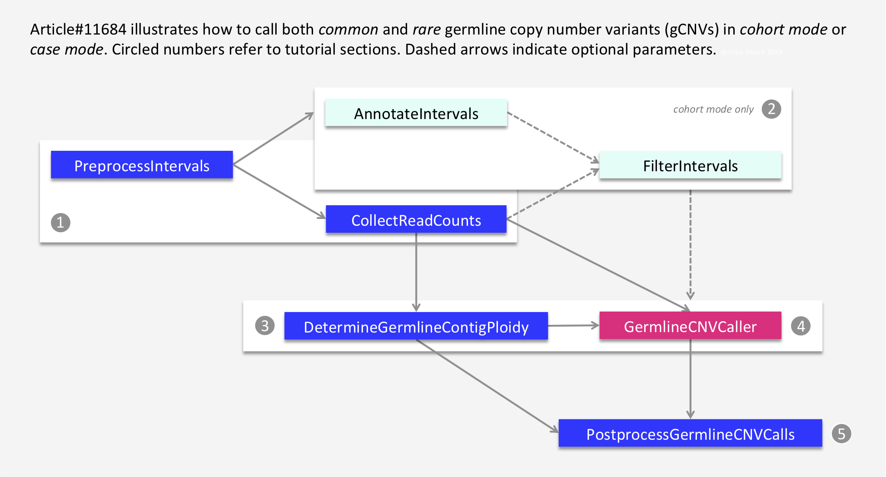
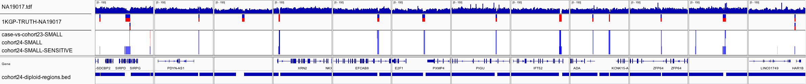
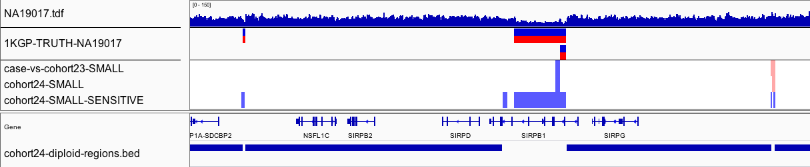
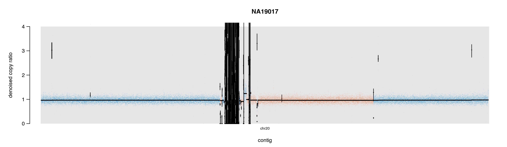
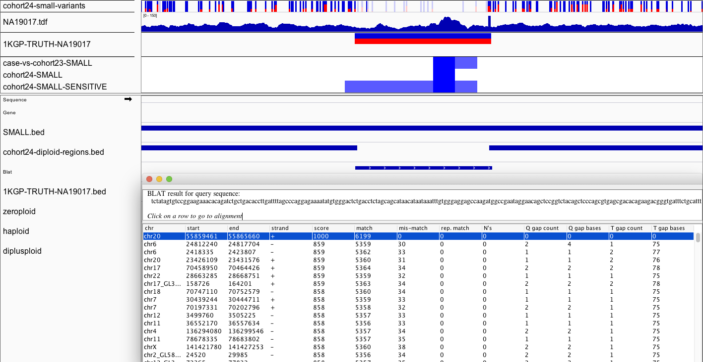
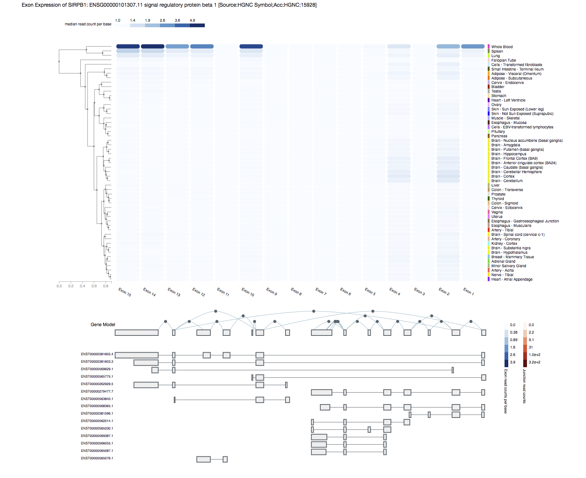
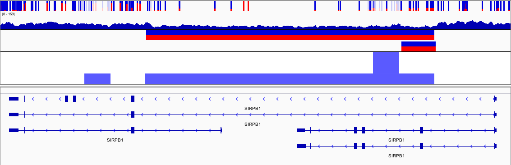
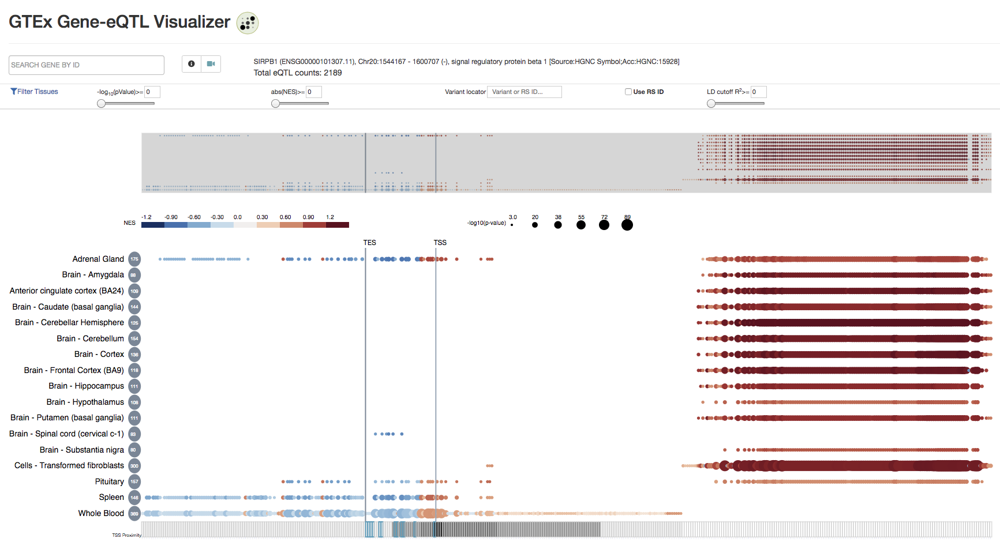

# (How to) Call germline copy number variants

by Soo Hee Lee (@shlee)

_20190322-4PM draft_ 

**Document is currently under review and in `BETA`. It is incomplete and may contain inaccuracies. Expect changes to the content.**

{later change to:}
**Document is in `BETA`. It may be incomplete and/or inaccurate. Post suggestions and read about updates in the _Comments_ section.**

---
[](images-gcnv/gcnv_workflow_diagram_20190321_sooheelee.png) 

The tutorial outlines steps in detecting _germline_ copy number variants (gCNVs) and illustrates two workflow modes--**cohort mode** and **case mode**. The _cohort mode_ simultaneously generates a cohort model and calls CNVs for the cohort samples. The _case mode_ analyzes a single sample against an already constructed cohort model. The same workflow steps apply to both targeted exome and whole genome sequencing (WGS) data. The workflow is able to call both _rare_ and _common_ events, e.g. amylase locus multiallelic CNVs, and intelligently handles allosomal ploidies, i.e. mixed male and female cohorts. 

Researchers should expect to tune workflow parameters from the provided defaults for their data. For the _cohort mode_, the general recommendation is at least a hundred samples to start.

The figure diagrams the connections between the workflow tools. **Section 1** creates an intervals list and collects raw counts data over the intervals from alignment data. **Section 2** shows optional _cohort mode_ steps to annotate intervals with covariates for use in filtering intervals as well as for use in explicit modeling. The section additionally removes outlier counts intervals using the counts data. **Section 3** generates global baseline observations for the data and models and calls the ploidy of each contig. **Section 4** is at the heart of the workflow and models per-interval copy number. Because of the high intensity of compute model fitting requires, the tutorial showcases how to analyze data in small batches. Finally, **Section 5** calls per-sample copy number events per interval and also segments the results. Results are in VCF format.

► This workflow is not appropriate for bulk tumor samples, as it infers absolute copy numbers. For somatic copy number alteration calling, see [Tutorial#11682](https://software.broadinstitute.org/gatk/documentation/article?id=11682).
► For pipelined workflows, see the [gatk GitHub](https://github.com/broadinstitute/gatk) repository's [scripts/cnv_wdl](https://github.com/broadinstitute/gatk/tree/master/scripts/cnv_wdl) directory. Be sure to obtain a tagged version of the script, e.g. [v4.1.0.0](https://github.com/broadinstitute/gatk/tree/4.1.0.0/scripts/cnv_wdl/germline), following instructions in [Section 4 of Article#23405](https://software.broadinstitute.org/gatk/documentation/article?id=23405#4).
► {yet to be merged v4.1.1.0} A whitepaper detailing the mathematics behind the modeling is in the [gatk GitHub]() repository's [XXX/YYY]() directory.
► Poster(s) of gCNV methods by [@asmirnov](https://gatkforums.broadinstitute.org/gatk/profile/asmirnov) (2018) and [@Mehrtash](https://gatkforums.broadinstitute.org/dsde/profile/Mehrtash) (2017) are in the [GATK Poster Presentations GoogleDrive](https://drive.google.com/open?id=1XDXlck-El8uZ7e60ANDSHycEpkgo6NoP).

<a name="top"></a>

---
### Jump to a section
1. [Collect raw counts data with PreprocessIntervals and CollectFragmentCounts](#1)

    ☞ [1.1 How do I view HDF5 format data?](https://gatkforums.broadinstitute.org/dsde/discussion/11682#1.1)
2. [(Optional) Annotate intervals with features and subset regions of interest with FilterIntervals](#2)
3. [Call autosomal and allosomal contig ploidy with DetermineGermlineContigPloidy](#3)
4. [Model interval copy number for a cohort or case sample with GermlineCNVCaller](#4)

    ☞ [4.1 How do I increase the sensitivity of detection?](#4.1)
    ☞ [4.2 How do I make interval lists for scattering?](#4.2)
    
5. [Call copy number segments and consolidate sample results with PostprocessGermlineCNVCalls](#5)
6. [Visualize results in IGV and compare to truthset calls](#6)

    ☞ [6.1 How do I make SEG format files from gCNV results?](#6.1)

7. [Some additional discussion](#7)

<a name="tools"></a>
 
---
### Tools involved
Discussion of python environment and packages. 

- GATK 4.1.0.0. 
- [](images-gcnv/wikimedia_commons_python_logo_green.svg.png) Of note, workflow tools DetermineGermlineContigPloidy, GermlineCNVCaller and PostprocessGermlineCNVCalls require a Python environment with specific packages, e.g. the gCNV computational python module _gcnvkernel_. See [Article#12836](https://software.broadinstitute.org/gatk/documentation/article?id=12836) for instructions on setting up and managing the envirnoment with the user-friendly _conda_. Once the _conda_ environment is set up, e.g. with `conda env create -f gatkcondaenv.yml`, activate it with `source activate gatk` or `conda activate gatk` before running the tool. The tutorial denotes tools requiring the special python environment with the icon to the right.

    Alternatively, use the [broadinstitute/gatk Docker](https://hub.docker.com/r/broadinstitute/gatk/), which activates the Python environment by default. Allocation of at least 8GB memory to Docker is recommended for the tutorial commands. See [Article#11090](https://gatkforums.broadinstitute.org/gatk/discussion/11090/how-to-run-gatk-in-a-docker-container) for instructions to launch a Docker container.

### Download example data
The tutorial provides example small WGS data sourced from the 1000 Genomes Project. _Cohort mode_ illustrations use 24 samples, while _case mode_ illustrations analyze one sample against a cohort model made from the remaining 23 samples. _The tutorial uses a fraction of the workflow's recommended hundred samples for ease of illustration._ Furthermore, commands in each step use one of three differently sized intervals lists for efficient analysis. Coverage data are from the entirety of chr20, chrX and chrY. So although a step may analyze a subset of regions, it is possible to instead analyze all regions from the three contigs in _case_ or _cohort modes_.

Download **tutorial_XXX.tar.gz** either from the [GoogleDrive](https://drive.google.com/open?id=1JnZn5jLQs3kwg6EToeoH8J4kl2Vn69YH) or from the [FTP site](ftp://gsapubftp-anonymous@ftp.broadinstitute.org/tutorials/datasets). To access the ftp site, leave the password field blank. If the GoogleDrive link is broken, please let us know. The tutorial also requires the GRCh38 reference FASTA, dictionary and index. These are available from the [GATK Resource Bundle](https://software.broadinstitute.org/gatk/download/bundle). The example data is from the [1000 Genomes project](http://www.internationalgenome.org/) Phase 3 aligned to GRCh38 and preprocessed by the Project. 

<a name="1"></a>

----
## 1. Collect raw counts data with PreprocessIntervals and CollectReadCounts
[PreprocessIntervals]() pads exome targets and bins WGS intervals. Binning refers to creating equally sized intervals across the reference. For example, 1000 base binning would define chr1:1-1000 as the first bin and chr1:1001-2000 as the second bin and so on. Because counts of reads on reference `N` bases are not meaningful, the tool automatically excludes bins with all `N`s. For GRCh38 chr1, non-N sequences start at base 10,001, so the first bin becomes 

```
chr1    10001   11000   +       .
```

**For WGS data, bin entirety of reference, e.g. with 1000 base intervals.**

```
gatk PreprocessIntervals \
-R ~/ref/Homo_sapiens_assembly38.fasta \
--padding 0 \
-imr OVERLAPPING_ONLY \
-O grch38.preprocessed.interval_list
```
This produces a Picard-style intervals list of 1000 base bins.

**For exome data, pad target regions, e.g. with 250 bases.**

```
gatk PreprocessIntervals \
-R ~/ref/Homo_sapiens_assembly38.fasta \
-L targets.interval_list \
--bin-length 0 \
-imr OVERLAPPING_ONLY \
-O targets.preprocessed.interval_list
```
This produces a Picard-style intervals list of exome target regions padded by 250 bases on either side.


**The tutorial bins three contigs.**

The contigs in `gcnv.list` subset the reference to chr20, chrX and chrY.

```
gatk PreprocessIntervals \
-R ref/Homo_sapiens_assembly38.fasta \
--padding 0 \
-L gcnv.list \
-imr OVERLAPPING_ONLY \
-O chr20XY.interval_list
```

This generates a Picard-style intervals list with 242,549 intervals. The file has a header section with `@` header lines and a five-column body. See [Article#11009](https://gatkforums.broadinstitute.org/gatk/discussion/11009) for a description of the columns.

**Comments on select parameters**

- For WGS, the default 1000 `--bin-length` is the recommended starting point for typical 30x data. Be sure to set `--interval-padding 0` to disable padding into N-regions. Bin size should correlate with depth of coverage, e.g. lower coverage data should use larger bin size while higher coverage data can support smaller bin size. The size of the bin defines the resolution of CNV calls. The factors to consider in sizing include how noisy the data is, average coverage depth and how even coverage is across the reference.  
- For targeted exomes, provide the exome capture kit's target intervals with `-L`, set `--bin-length 0` to disable binning and pad the intervals with `--interval-padding 250` or other desired length. 
- Provide intervals to exclude from analysis with `--exclude-intervals` or `-XL`, e.g. centromeric regions. Consider using this option especially if data is aligned to a reference other than GRCh38. The workflow enables excluding regions later, downstream again using `-XL`. A frugal strategy is to collect read counts using the entirety of intervals and then to exclude undesirable regions later at the FilterIntervals step ([section 2](#2)), at the GermlineCNVCaller step ([section 5](#5)) or post-calling.

---
[CollectReadCounts](https://software.broadinstitute.org/gatk/documentation/tooldocs/current/org_broadinstitute_hellbender_tools_copynumber_CollectReadCounts.php) tabulates the raw integer counts of reads overlapping an interval. The tutorial has already collected read counts ahead of time for the three contigs--chr20, chrX and chrY. Here, we make the motions of collecting read counts using small data.

**Count reads per bin using CollectReadCounts**

```
gatk CollectReadCounts \
-L chr20sub.interval_list \
-R ref/Homo_sapiens_assembly38.fasta \
-imr OVERLAPPING_ONLY \
-I NA19017.chr20sub.bam \
--format TSV \
-O sandbox/2_NA19017.tsv 
```

This generates a TSV format table of read counts. 

**Comments on select parameters**

- The tutorial generates text-based TSV (tab-separated-value) format data instead of the default [HDF5 format](https://software.broadinstitute.org/gatk/documentation/article?id=11508) by adding `--format TSV` to the command. Omit this option to generate the default HDF5 format. Downstream tools process HDF5 format more easily. 
- Here and elsewhere in the workflow, set `--interval-merging-rule` (`-imr`) to `OVERLAPPING_ONLY`, to prevent the tool from merging abutting intervals. 
- The tool employs a number of engine-level read filters. Of note are [NotDuplicateReadFilter](https://software.broadinstitute.org/gatk/documentation/tooldocs/current/org_broadinstitute_hellbender_engine_filters_ReadFilterLibrary$NotDuplicateReadFilter.php) and [MappingQualityReadFilter](https://software.broadinstitute.org/gatk/documentation/tooldocs/current/org_broadinstitute_hellbender_engine_filters_MappingQualityReadFilter.php). This means the tool excludes reads marked as duplicate and excludes reads with mapping quality less than 10. Change the mapping quality threshold with the `--minimum-mapping-quality` option. 

After the header section, denoted by lines starting with `@`, the body of the data has a column header line followed by read counts for every interval in the intervals list, like so:

```
CONTIG  START   END     COUNT
chr20   60001   61000   253
chr20   61001   62000   560
chr20   62001   63000   465
chr20   63001   64000   108
chr20   64001   65000   261
```
{from NA18525_chr20_X_Y.tsv; look for screenshot 9/18 2:15PM}

<a name="1.1"></a>
### ☞ 1.1 How do I view HDF5 format data?
See [Article#11508](https://software.broadinstitute.org/gatk/documentation/article?id=11508) for an overview of the format and instructions on how to navigate the data with external application _HDFView_. The article illustrates features of the format using data generated in another tutorial, [Tutorial#11682](https://gatkforums.broadinstitute.org/dsde/discussion/11682/).

<a name="2"></a>
[back to top](#top)

---

## 2.	(Optional) Annotate intervals with features and subset regions of interest with FilterIntervals
The steps in this section pertain to the _cohort mode_. 

Researchers may desire to subset the intervals that GermlineCNVCaller will analyze, either to exclude potentially problematic regions or to retain only regions of interest. For example one may wish to exclude regions where all samples in a large cohort have copy number zero. Filtering intervals can be especially impactful for analyses that utilize references other than GRCh38 or that are based on sequencing technologies affected by sequence context, e.g. targeted exomes. Explicit GC-correction is recommended for exome data.

Towards deciding which regions to exclude, [AnnotateIntervals](https://software.broadinstitute.org/gatk/documentation/tooldocs/current/org_broadinstitute_hellbender_tools_copynumber_AnnotateIntervals.php) labels the given intervals with GC content and additionally with mappability and segmental duplication content if given the respective optional resource files. [FilterIntervals](https://software.broadinstitute.org/gatk/documentation/tooldocs/current/org_broadinstitute_hellbender_tools_copynumber_FilterIntervals.php) then subsets the intervals list based on the annotations and other tunable thresholds. 

The default v4.1.0.0 `cnv_germline_cohort_workflow.wdl` pipeline script omits explicit gc-correction. The tutorial data is WGS data aligned to GRCh38, and the gCNV workflow can process the entirety of the data without issue, without the need for any interval filtering. The tutorial illustrates the optional AnnotateIntervals step by performing explicit GC-content-based filtering.

**AnnotateIntervals with GC content**

```	
gatk AnnotateIntervals \
-L chr20XY.interval_list \
-R ref/Homo_sapiens_assembly38.fasta \
-imr OVERLAPPING_ONLY \
-O chr20XY.annotated.tsv
```

This produces a four-column table, like so:

```
CONTIG	START	END	GC_CONTENT
chr20	60001	61000	0.470000
chr20	61001	62000	0.473000
chr20	62001	63000	0.482000
chr20	63001	64000	0.469333
```

**Comments on select parameters**

- The tool requires the `-R` reference and the `-L` intervals. The tool calculates GC-content for the intervals using the reference.
- Additionally annotate mappability by providing a `--mappability-track` regions file in either `.bed` or `.bed.gz` format. For example, the Hoffman lab at the University of Toronto provides human and mouse mappability BED files for various kmer lengths at [https://bismap.hoffmanlab.org/](https://bismap.hoffmanlab.org/). The accompanying publication is titled [_Umap and Bismap: quantifying genome and methylome mappability_](https://doi.org/10.1093/nar/gky677).
- Additionally annotate segmental duplication content by providing a `--segmental-duplication-track` regions file in either `.bed` or `.bed.gz` format. 
- Exclude undesirable intervals with the `-XL` parameter, e.g. intervals corresponding to centromeric regions. 

---

[FilterIntervals](https://software.broadinstitute.org/gatk/documentation/tooldocs/current/org_broadinstitute_hellbender_tools_copynumber_FilterIntervals.php) takes preprocessed intervals _and_ either an annotated intervals file _or_ read counts file(s). When given both types of data, the tool retains the intervals that intersect from filtering on each data type. As mentioned previously, the v4.1.0.0 `cnv_germline_cohort_workflow.wdl` pipeline script makes explicit gc-correction and hence the AnnotateIntervals task optional. The tutorial includes it for illustrative purposes. Given read counts files are required by the pipeline script, by default the pipeline always performs the FilterIntervals step on read counts.

**FilterIntervals based on GC-content and cohort extreme counts**

```
gatk FilterIntervals \
-L chr20XY.interval_list \
--annotated-intervals chr20XY.annotated.tsv \
-I cvg/HG00096.tsv -I cvg/HG00268.tsv -I cvg/HG00419.tsv -I cvg/HG00759.tsv \
-I cvg/HG01051.tsv -I cvg/HG01112.tsv -I cvg/HG01500.tsv -I cvg/HG01565.tsv \
-I cvg/HG01583.tsv -I cvg/HG01595.tsv -I cvg/HG01879.tsv -I cvg/HG02568.tsv \
-I cvg/HG02922.tsv -I cvg/HG03006.tsv -I cvg/HG03052.tsv -I cvg/HG03642.tsv \
-I cvg/HG03742.tsv -I cvg/NA18525.tsv -I cvg/NA18939.tsv -I cvg/NA19017.tsv \
-I cvg/NA19625.tsv -I cvg/NA19648.tsv -I cvg/NA20502.tsv -I cvg/NA20845.tsv \
-imr OVERLAPPING_ONLY \
-O chr20XY.cohort.gc.filtered.interval_list
```

This produces a Picard-style interval list containing a subset of the starting intervals (230,126 of 242,549). Of the filtered intervals, low GC-content filters 42 intervals, and extreme coverage counts from the 24 sample cohort remove an additional 12,381 intervals for a total of 12,423 filtered intervals (0.5122% of starting). 

**Comments on select parameters**    
  
- The tool requires the preprocessed intervals from [Section 1](#1). Provide the intervals with `-L`.      
- Given annotated intervals with `--annotated-intervals`, the tool filters intervals on the given annotation(s). 

    - GC-content thresholds are set by `--minimum-gc-content` and `--maximum-gc-content`, where defaults are 0.1 and 0.9, respectively. 
    - Mappability thresholds are set by `--minimum-mappability` and `--maximum-mappability`. Defaults are 0.9 and 1.0, respectively. 
    - Segmental duplication content thresholds are set by `--minimum-segmental-duplication-content` and `--maximum-segmental-duplication-content`. Defaults are 0.0 and 0.5, respectively. 
- Given read counts files, each with `-I` and in either HDF5 or TSV format, the tool filters intervals on low and extreme read counts with the following tunable thresholds.  

	- `--low-count-filter-count-threshold` default is 5
	- `--low-count-filter-percentage-of-samples` default is 90.0
	- `--extreme-count-filter-minimum-percentile` default is 1.0
	- `--extreme-count-filter-maximum-percentile` default is 99.0
	- `--extreme-count-filter-percentage-of-samples` default is 90.0

	The read counts data must match each other in intervals. 
	
	For the default parameters, the tool first filters intervals with a count less than 5 in greater than 90% of the samples. The tool then filters _the remaining_ intervals with a count percentile less than 1 or greater than 99 in a percentage of samples greater than 90%. These parameters effectively exclude intervals where all samples are deleted or have extreme outlier counts.
	
	To disable counts based filtering, e.g. when using the v4.1.0.0 `cnv_germline_cohort_workflow.wdl` pipeline script, set the two `percentage-of-samples` parameters as follows.
	
	```
	--low-count-filter-percentage-of-samples 100 \
	--extreme-count-filter-percentage-of-samples 100 \
	```
- Exclude undesirable intervals with the `-XL` parameter, e.g. intervals corresponding centromeric regions. Alternatively, these regions may be filtered at the PreprocessIntervals step ([section 1](#1)), at the GermlineCNVCaller step ([section 5](#5)) or manually filtered from the final callset.

<a name="3"></a>
[back to top](#top)

---

## 3.	Call autosomal and allosomal contig ploidy with DetermineGermlineContigPloidy 
[DetermineGermlineContigPloidy](https://software.broadinstitute.org/gatk/documentation/tooldocs/current/org_broadinstitute_hellbender_tools_copynumber_DetermineGermlineContigPloidy.php) calls contig level ploidies for both autosomal, e.g. human chr20, and allosomal contigs, e.g. human chrX and chrY. The tool determines baseline contig ploidies using sample coverages and _contig ploidy priors_ that give the prior probabilities for each ploidy state for each contig. 

[](#tools)&nbsp;**DetermineGermlineContigPloidy in COHORT MODE**

The _cohort_ mode requires a `--contig-ploidy-priors` table and produces a ploidy model. 

```
gatk DetermineGermlineContigPloidy \
-L chr20XY.cohort.gc.filtered.interval_list \
--interval-merging-rule OVERLAPPING_ONLY \
-I cvg/HG00096.tsv -I cvg/HG00268.tsv -I cvg/HG00419.tsv -I cvg/HG00759.tsv \
-I cvg/HG01051.tsv -I cvg/HG01112.tsv -I cvg/HG01500.tsv -I cvg/HG01565.tsv \
-I cvg/HG01583.tsv -I cvg/HG01595.tsv -I cvg/HG01879.tsv -I cvg/HG02568.tsv \
-I cvg/HG02922.tsv -I cvg/HG03006.tsv -I cvg/HG03052.tsv -I cvg/HG03642.tsv \
-I cvg/HG03742.tsv -I cvg/NA18525.tsv -I cvg/NA18939.tsv -I cvg/NA19017.tsv \
-I cvg/NA19625.tsv -I cvg/NA19648.tsv -I cvg/NA20502.tsv -I cvg/NA20845.tsv \
--contig-ploidy-priors chr20XY_contig_ploidy_priors.tsv \
--output . \
--output-prefix ploidy \
--verbosity DEBUG
```
This produces a `ploidy-calls` directory and a `ploidy-model` directory.  

The `ploidy-calls` directory contains a folder of data for each sample in the cohort including the contig ploidy calls. Each sample directory, e.g. `ploidy-calls/SAMPLE_0`, contains five files. 

1. `contig_ploidy.tsv` notes the ploidy and genotype quality (GQ) of the ploidy call for each contig.
2. `global_read_depth.tsv` notes the global read deapth and average ploidy across all the intervals.
3. `mu_psi_s_log__.tsv` contains a quality control metric that captures the noisiness of the sample.
4. `sample_name.txt` contains the readgroup sample (RG SM) name.
5. `std_psi_s_log__.tsv` contains the standard deviation of the noise.

The `ploidy-model` directory contains aggregated model data for the cohort. This is the model to provide to a case-mode DetermineGermlineContigPloidy analysis and to GermlineCNVCaller. The `ploidy-model` directory contains the eight files as follows.

1. `contig_ploidy_prior.tsv` is a copy of the ploidy priors given to the tool.
2. `gcnvkernel_version.json` notes the version of the kernel.
3. `interval_list.tsv` recapitulates the intervals used, e.g. the filtered intervals.
4. `mu_mean_bias_j_lowerbound__.tsv`
5. `mu_psi_j_log__.tsv`
6. `ploidy_config.json`
7. `std_mean_bias_j_lowerbound__.tsv`
8. `std_psi_j_log__.tsv`

{Run in Docker exactly as shown for chr20XY = takes <3 minutes}

---
[](#tools)&nbsp;**DetermineGermlineContigPloidy in CASE MODE**

The _case_ mode calls contig ploidies for each sample against the ploidy model given by `--model`. The following command runs a single sample, sample NA19017, against a 23-sample cohort model.

```
gatk DetermineGermlineContigPloidy \
--model cohort-23wgs-20190213-contig-ploidy-model \
-I cvg/NA19017.tsv \
-O . \
--output-prefix ploidy-case \
--verbosity DEBUG
```
This produces a `ploidy-case-calls` directory, which in turn contains a directory of sample data, `SAMPLE_0`. A list of the five resulting files is some paragraphs above.

{Run in Docker; takes ~1 min}

**Comments on select parameters**    

- It is possible to analyze multiple samples in a _case mode_ command. Provide each sample with `-I`.   
- For the `-L` intervals, supply the most processed intervals list. For the tutorial, this is the filtered intervals. The _case mode_ automatically derives the `-L` intervals from the ploidy model directory. 
- Provide a `--contig-ploidy-priors` table containing the per-contig prior probabilities for integer ploidy state. The _case mode_ automatically derives the priors from the ploidy model directory. This resource is describe further in the [tool documentation](https://software.broadinstitute.org/gatk/documentation/tooldocs/current/org_broadinstitute_hellbender_tools_copynumber_DetermineGermlineContigPloidy.php). For example the tutorial uses the following contig ploidy priors.  

    ```
    CONTIG_NAME	PLOIDY_PRIOR_0	PLOIDY_PRIOR_1	 PLOIDY_PRIOR_2	PLOIDY_PRIOR_3
    chr20	0	0.01	0.98	0.01
    chrX	0.01	0.49	0.49	0.01
    chrY	0.495	0.495	0.01	0
    ```
	{replace with snippet}

The results for NA19017, from either the _cohort mode_ or the case mode, show ploidy 2 for chr20 and chrX and ploidy 0 for chrY. The PLOIDY_GQ quality metrics differ slightly for the modes. Checking the ploidy calls for the samples against metadata confirms expectations.

```
@RG	ID:GATKCopyNumber	SM:NA19017
CONTIG	PLOIDY	PLOIDY_GQ
chr20	2	134.54229278541266
chrX	2	108.12726963397202
chrY	0	123.4659462762548
```

{show screenshot of results--sex summary table}
{SHOW METADATA TABLE? maybe}

<a name="4"></a>
[back to top](#top)

---
## 4.	Call copy number variants with GermlineCNVCaller
As the [GermlineCNVCaller tool documentation](https://software.broadinstitute.org/gatk/documentation/tooldocs/current/org_broadinstitute_hellbender_tools_copynumber_GermlineCNVCaller.php) states under _Important Remarks_ (v4.1.0.0), the tool should see data from a large enough genomic region so as to be exposed to diverse genomic features. _The current recommendation is to provide at least ~10–50Mbp genomic coverage per shard._ This applies to exomes or WGS. This allows reliable inference of bias factors including GC bias. The limitation to analyzing larger regions is memory. As an analysis covers more genomic terratory, memory requirements increase. Memory requirements increase linearly with number of samples, size of genomic region, max copy number state and number of bias factors.

For expediency, the tutorial commands below analyze small data, specifically the 1400 bins in `twelveregions.cohort.gc.filtered.interval_list`. The tutorial splits the 1400 bins into two shards with 700 bins each to illustrate batch analysis, or scattering. This results in ~0.7Mbp genomic coverage per shard. See [section 4.2](#4.2) for how to split interval lists by number of intervals. Each concurrently run cohort-mode shard analysis completes in ~3-4 minutes on [@shlee](https://gatkforums.broadinstitute.org/gatk/profile/20865/shlee)'s MacBook Pro.

- The tutorial coverage data are sufficient to analyze the ~15K bins in  `chr20sub.cohort.gc.filtered.interval_list` as well as the entirety of chr20, chrX and chrY using the ~230K bins of  `chr20XY.cohort.gc.filtered.interval_list`. [@shlee](https://gatkforums.broadinstitute.org/gatk/profile/20865/shlee) manually curated the these regions for illustrative value.

    - The ~230K bins give 46 shards at 5K bins per shard. When running the default parameters of the v4.1.0.0 WDL cohort-mode workflow on the cloud, most of the shard analyses complete in ~1.5 hours.
    - The ~15K bins, at 5K bins per shard, give three shards. When running the default parameters in a GATKv4.1.0.0 Docker locally again on [@shlee](https://gatkforums.broadinstitute.org/gatk/profile/20865/shlee)'s MacBook Pro, each cohort-mode shard analysis takes ~20 minutes. 

[](#tools)&nbsp;**GermlineCNVCaller in COHORT MODE**

Call gCNVs on the 24-sample cohort in _two_ scatters. Notice the different `-L` intervals and `--output-prefix` basenames. 

```
gatk GermlineCNVCaller \
    --run-mode COHORT \
    -L scatter-sm/twelve_1of2.interval_list \
    -I cvg/HG00096.tsv -I cvg/HG00268.tsv -I cvg/HG00419.tsv -I cvg/HG00759.tsv \
    -I cvg/HG01051.tsv -I cvg/HG01112.tsv -I cvg/HG01500.tsv -I cvg/HG01565.tsv \
    -I cvg/HG01583.tsv -I cvg/HG01595.tsv -I cvg/HG01879.tsv -I cvg/HG02568.tsv \
    -I cvg/HG02922.tsv -I cvg/HG03006.tsv -I cvg/HG03052.tsv -I cvg/HG03642.tsv \
    -I cvg/HG03742.tsv -I cvg/NA18525.tsv -I cvg/NA18939.tsv -I cvg/NA19017.tsv \
    -I cvg/NA19625.tsv -I cvg/NA19648.tsv -I cvg/NA20502.tsv -I cvg/NA20845.tsv \
    --contig-ploidy-calls ploidy-calls \
    --annotated-intervals twelveregions.annotated.tsv \
    --interval-merging-rule OVERLAPPING_ONLY \
    --output cohort24-twelve \
    --output-prefix cohort24-twelve_1of2 \
    --verbosity DEBUG
```

```
gatk GermlineCNVCaller \
    --run-mode COHORT \
    -L scatter-sm/twelve_2of2.interval_list \
    -I cvg/HG00096.tsv -I cvg/HG00268.tsv -I cvg/HG00419.tsv -I cvg/HG00759.tsv \
    -I cvg/HG01051.tsv -I cvg/HG01112.tsv -I cvg/HG01500.tsv -I cvg/HG01565.tsv \
    -I cvg/HG01583.tsv -I cvg/HG01595.tsv -I cvg/HG01879.tsv -I cvg/HG02568.tsv \
    -I cvg/HG02922.tsv -I cvg/HG03006.tsv -I cvg/HG03052.tsv -I cvg/HG03642.tsv \
    -I cvg/HG03742.tsv -I cvg/NA18525.tsv -I cvg/NA18939.tsv -I cvg/NA19017.tsv \
    -I cvg/NA19625.tsv -I cvg/NA19648.tsv -I cvg/NA20502.tsv -I cvg/NA20845.tsv \
    --contig-ploidy-calls ploidy-calls \
    --annotated-intervals twelveregions.annotated.tsv \
    --interval-merging-rule OVERLAPPING_ONLY \
    --output cohort24-twelve \
    --output-prefix cohort24-twelve_2of2 \
    --verbosity DEBUG
```

This produces per-interval gCNV calls for each of the cohort samples and a gCNV model for the cohort. Each command produces three directories within `cohort24-twelve`--a `cohort24-twelve_1of2-calls` folder of per sample gCNV call results, a `cohort24-twelve_1of2-model` folder of cohort model data and a `cohort24-twelve_1of2-tracking` folder of data that tracks model fitting. The table a few paragraphs below lists the _cohort mode_ data files alongside _case mode_ files.

---
[](#tools)&nbsp;**GermlineCNVCaller in CASE MODE**

Call gCNVs on a sample against a cohort model. The case analysis must use the same scatter approach as the model generation. So, as above, we run two shard analyses. Here, `--model` and `--output-prefix` differ between the scatter the commands. Each run completes in ~ a minute. 

```
gatk GermlineCNVCaller \
    --run-mode CASE \
    -I cvg/NA19017.tsv \
    --contig-ploidy-calls ploidy-case-calls \
    --model cohort23-twelve/cohort23-twelve_1of2-model \
    --output case-twelve-vs-cohort23 \
    --output-prefix case-twelve-vs-cohort23_1of2 \
    --verbosity DEBUG
```   
```
gatk GermlineCNVCaller \
    --run-mode CASE \
    -I cvg/NA19017.tsv \
    --contig-ploidy-calls ploidy-case-calls \
    --model cohort23-twelve/cohort23-twelve_2of2-model \
    --output case-twelve-vs-cohort23 \
    --output-prefix case-twelve-vs-cohort23_2of2 \
    --verbosity DEBUG
```

This produces both `calls` and `tracking` results folders with, e.g. the `case-twelve-vs-cohort23_1of2` basename. The `case-twelve-vs-cohort23_1of2-calls` folder contains case sample gCNV call results and the `case-twelve-vs-cohort23_1of2-tracking` folder contains model fitting results. The resulting _case mode_ data files are listed in the table below alongside _cohort mode_ data files.

 |_GermlineCNVCaller result file_|&nbsp;&nbsp;&nbsp;&nbsp;**COHORT mode directory**&nbsp;&nbsp;&nbsp;&nbsp;|&nbsp;&nbsp;&nbsp;&nbsp;&nbsp;&nbsp; **CASE mode directory** &nbsp;&nbsp;&nbsp;&nbsp;&nbsp;&nbsp;
:-----:|-----|:-----:|:-----:
1|`baseline_copy_number_t.tsv`|calls/sample|calls/sample
2|`denoised_copy_ratios_mu.tsv`|calls/sample|calls/sample
3|`denoised_copy_ratios_std.tsv`|calls/sample|calls/sample
4|`log_c_emission_tc.tsv`|calls/sample|calls/sample
5|`log_q_c_tc.tsv`|calls/sample|calls/sample
6|`mu_psi_s_log__.tsv`|calls/sample|calls/sample
7|`mu_read_depth_s_log__.tsv`|calls/sample|calls/sample
8|`mu_z_sg.tsv`|calls/sample|calls/sample
9|`mu_z_su.tsv`|calls/sample|-
10|`sample_name.txt`|calls/sample|calls/sample
11|`std_psi_s_log__.tsv`|calls/sample|calls/sample
12|`std_read_depth_s_log__.tsv`|calls/sample|calls/sample
13|`std_z_sg.tsv`|calls/sample|calls/sample
14|`std_z_su.tsv`|calls/sample|-
15|`calling_config.json`|model|calls
16|`denoising_config.json`|model|calls
17|`gcnvkernel_version.json`|model|calls
18|`interval_list.tsv`|model|calls
19|`log_q_tau_tk.tsv`|model|-
20|`mu_W_tu.tsv`|model|-
21|`mu_ard_u_log__.tsv`|model|-
22|`mu_log_mean_bias_t.tsv`|model|-
23|`mu_psi_t_log__.tsv`|model|-
24|`std_W_tu.tsv`|model|-
25|`std_ard_u_log__.tsv`|model|-
26|`std_log_mean_bias_t.tsv`|model|-
27|`std_psi_t_log__.tsv`|model|-
28|`main_elbo_history.tsv`|tracking|-
29|`warm_up_elbo_history.tsv`|tracking|-
30|`elbo_history.tsv`|-|tracking

---
**Comments on select parameters**    

- The `-O` output directory must be extant before running the command.
- The default `--max-copy-number` is capped at 5. This means the tool reports any events with more copies as CN5.
- For the cohort mode, provide `--annotated-intervals` to include the annotations as covariates. These must contain all of the `-L` intervals. The `-L` intervals is an exact match or a subset of the annotated intervals.
- For the case mode, the tool accepts only a single `--model` directory at a time. Also, as of this writing, consolidating sharded models in not possible. So the case must be analyzed with the same number of scatters as the cohort model run. The _case mode_ parameters appear fewer than the _cohort mode_ because the `--model` directory provides the seemingly missing requirements, i.e. the scatter intervals and the annotated intervals.
- For both modes, provide the `--contig-ploidy-calls` results from DetermineGermlineContigPloidy ([Section 3](#3)). This not only informs ploidy but also establishes baseline coverage and noise levels for each sample. Later, in [section 5](#5), GermlineCNVCaller's batched analyses refer back to these global observations.  
- `--verbosity DEBUG` allows tracking the Python gcnvkernel model fitting in the stdout, e.g. with information on denoising epochs and whether the model converged. The default INFO level verbosity is the next most verbose and emits only GATK Engine level messages. 

At this point, the workflow has done its most heavy lifting to produce data towards copy number calling. In [Section 5](#5), we consolidate the data from the scattered GermlineCNVCaller runs, perform segmentation and call copy number states.

> _One artificial construct of the tutorial is the use of full three contig ploidy calls data even when modeling copy number states for much smaller subset regions. This effectively stabilizes the small analysis._

---
<a name="4.1"></a>
### ☞ 4.1 How do I increase the sensitivity of detection?

The tutorial uses default GermlineCNVCaller modeling parameters. However, researchers should expect to tune parameters for data from different sequencing technologies. In particular, the parameters to start with are the [_coherence length_](http://singlephoton.wikidot.com/laser-light) parameters, _p-alt_, _p-active_ and the _psi-scale_ parameters. These hyperparameters are just a few of the plethora of adjustable parameters GermlineCNVCaller offers. Please refer to the [GermlineCNVCaller tool documentation](https://software.broadinstitute.org/gatk/documentation/tooldocs/current/org_broadinstitute_hellbender_tools_copynumber_GermlineCNVCaller.php) and the [gCNV mathematical whitepaper](XXXYetToBeMerged???) for detailed explainations, and ask on the [GATK Forum](https://gatkforums.broadinstitute.org/gatk/discussions) for further guidance. 

The tutorial illustrates one set of parameter changes for WGS data provided by [@markw](https://gatkforums.broadinstitute.org/gatk/profile/markw) of the GATK SV (_Structural Variants_) team that dramatically increase the sensitivity of calling on the tutorial data. [Section 6](#6) compares the results of using default vs. the increased-sensitivity parameters for the tutorial data. Given the absence of off-the-shelf filtering solutions for CNV calls, when tuning parameters to increase sensitivity, researchers should expect to perform additional due diligence on their own, especially for analyses that require high precision calls. 

**WGS parameters that increase sensitivity of calling from [@markw](https://gatkforums.broadinstitute.org/gatk/profile/markw)**

```
    --class-coherence-length 1000.0 \
    --cnv-coherence-length 1000.0 \
    --enable-bias-factors false \
    --interval-psi-scale 1.0E-6 \
    --log-mean-bias-standard-deviation 0.01 \
    --sample-psi-scale 1.0E-6 \
```
    
**Comments on select sensitivity parameters**  

- Decreasing `--class-coherence-length` from its default of 10,000bp to 1000bp decreases the expected length of contiguous segments. Factor for bin size when tuning. 
- Decreasing `--cnv-coherence-length` from its default 10,000bp to 1000bp decreases the expected length of CNV events. Factor for bin size when tuning. 
- Turning off `--enable-bias-factors` from the default `true` state to `false` turns off active discovery of learnable bias factors. This should always be on for targeted exome data.  
- Decreasing `--interval-psi-scale` from its default of 0.001 to 1.0E-6 reduces the scale  that is considered normal in per-interval noise.
- Decreasing `--log-mean-bias-standard-deviation` from its default of 0.1 to 0.01 reduces what is considered normal noise in bias factors.
- Decreasing `--sample-psi-scale` from its default of 0.0001 to 1.0E-6 reduces the scale that is considered normal in sample-to-sample variance. 

Additional parameters to consider include `--depth-correction-tau`, `--p-active` and `--p-alt`.

- The `--depth-correction-tau` argument has a default of 10000.0 (10K) and defines the precision of read depth pinning to its global value.
- The `--p-active` argument with default of 1e-2 (0.01) defines the the expected prevalence of CNV events.
- The `p-alt` argument with default of 1e-6 (0.000001) defines the prior probability of CNV states. 

---

<a name="4.2"></a>
### ☞ 4.2 How do I make interval lists for scattering?
The v4.1.0.0 `cnv_germline_cohort_workflow.wdl` pipeline script scatters, i.e. batches, the GermlineCNVCaller step. Each batch, or _shard_, analyzes a small genomic region defined in an intervals list that is subset from intervals produced either from PreprocessIntervals ([section 1](#1)) or from FilterIntervals ([section 2](#)). The script uses [Picard IntervalListTools](https://software.broadinstitute.org/gatk/documentation/tooldocs/current/picard_util_IntervalListTools.php) to break up the intervals list into _roughly balanced_ lists. 

Again, it is important GermlineCNVCaller sees large enough data with a variety of genomic features. The current recommendation is ~10–50Mbp coverage per shard. 

```
gatk IntervalListTools \
--INPUT chr20sub.cohort.gc.filtered.interval_list \
--SUBDIVISION_MODE INTERVAL_COUNT \
--SCATTER_CONTENT 5000 \
--OUTPUT scatter        
```        

This produces three intervals lists with ~5K intervals each. For the tutorial's 1Kbp bins, this gives ~5Mbp genomic coverage per batch. Each list is identically named `scattered.interval_list` within its own folder within the `scatter` directory. IntervalListTools systematically names the intermediate folders, e.g. `temp_0001_of_3`, `temp_0002_of_3` and `temp_0002_of_3`. 

**Comments on select parameters**

- The `--SUBDIVISION_MODE INTERVAL_COUNT` mode scatters intervals into similarly sized lists according to the count of intervals irregardless of base count. The tool intelligently distributes the  `chr20sub.cohort.gc.filtered.interval_list`'s ~15K intervals into lists of 5031, 5031 and 5033 intervals. This is preferable to having a fourth interval list with just 95 intervals.
- The tool has another useful feature in the context of the gCNV workflow. To subset `-I` binned intervals, provide the regions of interest with `-SI` (`--SECOND_INPUT`) and use the `--ACTION OVERLAPS` mode to create a new intervals list of the overlapping bins. Adding `--SUBDIVISION_MODE INTERVAL_COUNT --SCATTER_CONTENT 5000` will produce scatter intervals concurrently with the subsetting. 

<a name="5"></a>
[back to top](#top)

---

## 5.	Call copy number segments and consolidate sample results with PostprocessGermlineCNVCalls 

PostprocessGermlineCNVCalls consolidates the scattered GermlineCNVCaller results, performs segmentation and calls copynumber states. The tool generates per-interval and optional per-segment sample calls in VCF format. As such, the tool is run on a single sample at a time.

[](#tools)&nbsp;**PostprocessGermlineCNVCalls COHORT MODE**

Process a single sample from the 24-sample cohort using the sample index. For NA19017, the sample index is 19. 

```
gatk PostprocessGermlineCNVCalls \
--model-shard-path cohort24-twelve/cohort24-twelve_1of2-model \
--model-shard-path cohort24-twelve/cohort24-twelve_2of2-model \
--calls-shard-path cohort24-twelve/cohort24-twelve_1of2-calls \
--calls-shard-path cohort24-twelve/cohort24-twelve_2of2-calls \
--allosomal-contig chrX --allosomal-contig chrY \
--contig-ploidy-calls ploidy-calls \
--sample-index 19 \
--output-genotyped-intervals genotyped-intervals-cohort24-twelve-NA19017.vcf.gz \
--output-genotyped-segments genotyped-segments-cohort24-twelve-NA19017.vcf.gz \
--sequence-dictionary ref/Homo_sapiens_assembly38.dict
```

---
[](#tools)&nbsp;**PostprocessGermlineCNVCalls CASE MODE**

NA19017 is the singular sample with index 0.

```
gatk PostprocessGermlineCNVCalls \
--model-shard-path cohort23-twelve/cohort23-twelve_1of2-model \
--model-shard-path cohort23-twelve/cohort23-twelve_2of2-model \
--calls-shard-path case-twelve-vs-cohort23/case-twelve-vs-cohort23_1of2-calls \
--calls-shard-path case-twelve-vs-cohort23/case-twelve-vs-cohort23_2of2-calls \
--allosomal-contig chrX --allosomal-contig chrY \
--contig-ploidy-calls ploidy-case-calls \
--sample-index 0 \
--output-genotyped-intervals genotyped-intervals-case-twelve-vs-cohort23.vcf.gz \
--output-genotyped-segments genotyped-segments-case-twelve-vs-cohort23.vcf.gz \
--sequence-dictionary ref/Homo_sapiens_assembly38.dict
```

Each command generates two VCFs with indices. The `genotyped-intervals` VCF contains variant records for each analysis bin and therefore data covers only the interval regions. For the tutorial's small data, this gives 1400 records. The `genotyped-segments` VCF contains records for each contiguous copy number state segment. For the tutorial's small data, this is 30 and 31 records for _cohort_ and _case mode_ analyses, respectively. 

> _The two modes give highly concordant but slightly different results for sample NA19017. The factor that explains the difference is the contribution of the sample itself to the model._
 
**Comments on select parameters**

- Specify a `--model-shard-path` directory for each scatter of the cohort model.
- Specify a `--calls-shard-path` directory for each scatter of the cohort or case analysis.
- Specify the `--contig-ploidy-calls` directory for the cohort or case analysis.
- By default `--autosomal-ref-copy-number` is set to 2.
- Define allosomal contigs with the `--allosomal-contig` parameter.
- The tool requires specifying the `--output-genotyped-intervals` VCF. 
- Optionally generate segmented VCF results with `--output-genotyped-segments`. The tool segments the regions between the starting bin and the ending bin on a contig. The implication of this is that even if there is a large gap between two analysis bins on the same contig, if the copy number state is equal for the bins, then the bins and the entire region inbetween appear in the same segment. 
- The `--sample-index` refers to the index number given to a sample by GermlineCNVCaller. In _case mode_ for a single sample the index will always be zero.
- The `--sequence-dictionary` is optional. Without it, the tool generates unindexed VCF results. Alternatively, to produce the VCF indices, provide the `-R` reference fasta or use [IndexFeatureFile]() afterwards.

Here is the result. The header section with lines starting with `##` give information on the analysis and define the annotations. Notice the singular `END` annotation in the `INFO` column that denotes the end position of the event. This use of the `END` notation is reminiscent of [GVCF format](https://software.broadinstitute.org/gatk/documentation/article.php?id=4017) GVCF blocks. 

{gzcat genotyped-segments-case-twelve-vs-cohort23.vcf.gz}.

In the body of the data, as with any VCF, the first two columns give the contig and genomic start position for the variant. The third `ID` column concatenates together `CNV_contig_start_stop`, e.g. `CNV_chr20_1606001_1609000`. The `REF` column is always _N_ and the `ALT` column gives the two types of CNV events of interest in symbolic allele notation--`<DEL>` for deletion and `<DUP>` for duplication or amplification. Again, the `INFO` field gives the `END` position of the variant. The `FORMAT` field lists sample-level annotations `GT:CN:NP:QA:QS:QSE:QSS`. `GT` of 0 indicates normal ploidy, 1 indicates deletion and 2 denotes duplication. The `CN` annotation indicates the copy number state. For the tutorial small data, `CN` ranges from 0 to 3.

<a name="6"></a>
[back to top](#top)

---

## 6.	Visualize results in IGV and compare to truthset calls
The 1000 Genomes Project Phase 3 SV callset published in 2015 and titled _An integrated map of structural variation in 2,504 human genomes_ was a landmark effort ([https://doi.org/10.1038/nature15394](https://www.nature.com/articles/nature15394)). The tutorial uses calls subset from the corresponding GRCh38 callset as a truthset. Other SV resources are as follows.

- As of 2019/3/14, gnomAD provides population SV calls, which include CNVs. _Data is on the GRCh37/hg19 human reference assembly._ The biorxiv paper is at [here](https://www.biorxiv.org/content/biorxiv/early/2019/03/14/578674.full.pdf). It is possible to browse population SV calls in the [gnomAD browser](https://gnomad.broadinstitute.org/) . Toggle the upper-right corner button to display SV data instead of short variant data. 
- Another resource that [@cwhelan](https://gatkforums.broadinstitute.org/gatk/profile/cwhelan) shares is NCBI's  dbvar at [https://www.ncbi.nlm.nih.gov/dbvar/](https://www.ncbi.nlm.nih.gov/dbvar/). It is a database of human genomic structural variation. Data are available for human assembly versions GRCh37 and GRCh38.

Although IGV ([Integrative Genomics Viewer](http://software.broadinstitute.org/software/igv/)) visualizes VCF calls just fine, it is useful to heatmap color copy number states using [SEG format](http://software.broadinstitute.org/software/igv/SEG) data (`.seg` or `.seg.gz`). For large data, e.g. WGS genotyped intervals, for fast access, the indexed binary [BigWig format](http://software.broadinstitute.org/software/igv/bigwig) is best. 

[](images-gcnv/gcnv_igv_three_modes_twelve_regions_20190321_sooheelee.png)

The twelve regions show regions of truthset events 1Kbp or larger. Tracks are as follows. 

1. NA19017 BAM coverage histogram
2. 1000 Genomes Project integrated truthset CN calls for NA19017, which happen to only contain deletion calls 
3. Case-mode NA19017 segments using default parameters and small regions
4. Cohort-mode NA19017 segments using default parameters and small regions
5. Cohort-mode NA19017 segments using sensitive parameters ([section 4.1](#4.1)) and small regions
6. RefSeq Gene track
7. Regions where all 24 samples in the cohort were diploid from a separate full-sized analysis. Breaks indicate regions where at least one sample gives a copy number event.

Here, SEG track deletions range from light blue to blue (CN1-CN0) and amplifications from salmon to red (CN3-CN5). As the twelve regions show, the case and cohort mode give highly concordant results to each other. Towards the truthset, by eye it appears they are missing three of the calls in the regions. Turning the sensitivity knob up gives better concordance with truthset calls, as gCNV then calls two of the three missing calls. Both the default and sensitive parameter runs pick up additional events not in the truthset.

<center>[](images-gcnv/gcnv_igv_three_modes_SIRPB1_20190321_sooheelee.png)</center>

If we focus on the first region, we see the default and sensitive parameter runs give differently sized events such that the functional impact on SIRPB1 expression is likely different. [Section 7](#7) discusses this further.  

---

<a name="6.1"></a>
### 6.1 How do I make SEG format files from gCNV results?

Here is one approach to convert gCNV VCF results to SEG format data. These command works in Unix. For Linux, modification will be necessary, e.g. `zcat` replaces `gzcat`.

**[1] VariantsToTable to subset and columnize annotations**

```
gatk VariantsToTable \
-V genotyped-segments-case-twelve-vs-cohort23.vcf.gz \
-F CHROM -F POS -F END -GF NP -GF CN \
-O genotyped-segments-case-twelve-vs-cohort23.table.txt
```

**[2] Unix shell commands to convert to SEG format data**

This involves adding a first column with the sample name.

```
sampleName=$(gzcat genotyped-segments-case-twelve-vs-cohort23.vcf.gz | grep -v '##' | head -n1 | cut -f10)
awk -v sampleName=$sampleName 'BEGIN {FS=OFS="\t"} {print sampleName, $0}' genotyped-segments-case-twelve-vs-cohort23.table.txt > ${i}.seg; head ${i}.seg
```

**Combine [1] and [2] into a for-loop to process multiple gCNV VCFs into SEGs**


```
for i in `ls genotyped-segments*.vcf.gz`; 
do sampleName=$(gzcat $i | grep -v '##' | head -n1 | cut -f10); 
gatk4100 VariantsToTable -V ${i} -F CHROM -F POS -F END -GF NP -GF CN -verbosity ERROR -O ${i}.table.txt; 
awk -v sampleName=$sampleName 'BEGIN {FS=OFS="\t"} {print sampleName, $0}' ${i}.table.txt > ${i}.seg; head ${i}.seg; 
done
```

<a name="7"></a>
[back to top](#top)

---
## 7.	Some additional discussion

If research aims focus on rare gCNV events only, e.g. non-multialleleic CNV singletons for a sample compared to a cohort, it is worth looking into the [GATK4 ModelSegments CNV workflow](https://software.broadinstitute.org/gatk/documentation/article?id=11682), which is sensitive to fractional changes and runs amazingly quickly. Note the ModelSegments CNV workflow is designed for somatic CNA detection. Below is one possible outcome from running ModelSegments CNV on NA19017 against a PoN made from the remaining 23 samples.

[](images-gcnv/gcnv_modelsegments_NA19017.modeled_20190322_sooheelee.png) 

Before moving to the final discussion subsections, my thanks to [@slee](https://gatkforums.broadinstitute.org/gatk/profile/slee), no relation, for guidance and insights on the gCNV workflow.

<a name="7.1"></a>
### ☞ 7.1 How do gCNV calls correlate with short variant calls?
[](images-gcnv/gcnv_igv_three_modes_filteredshortvariants_20190321_sooheelee.png) If we examine regions the short variant discovery workflow filters alongside our CNV events (top track), we see an interesting correlation. My thanks to [@bshifaw](https://gatkforums.broadinstitute.org/gatk/profile/bshifaw) for graceously agreeing to prepare the short variant callset. For the particular locus to the right, it appears short variants coinciding with the copy number event are mostly filtered. What could explain this coincidence?

Blatting the region of the CNV event shows many other loci with high sequence similarity and [lower-case reference bases](https://gatkforums.broadinstitute.org/gatk/discussion/7857/reference-genome-components). This region's sequence is repeteted in the genome.

Many other copy number events regions do not show such swaths of coincident filtered short variants. For these other regions, it may be desirable to call short variants with a corrected copy number, e.g. using HaplotypeCaller's `-ploidy` argument and `-L` intervals argument. The GATK short variant discovery workflow is amenable to calling on different copy number regions as well as on mixed copy number regions. It is possible to plan ahead for minimal HaplotypeCaller GCVF mode runs as alluded to in [this discussion](https://gatkforums.broadinstitute.org/gatk/discussion/13142/inference-of-genotype-likelihoods-for-lower-ploidy-based-on-genotyping-at-higher-ploidy-using-gatk).

---
<a name="7.2"></a>
### ☞ 7.2 How can I explore functional implications?
[](images-gcnv/gcnv_gtex_exon_expression_SIRPB1_20190321_sooheelee.png) 

Towards dissecting functional implications, researchers may find cosulting the Broad [GTEx portal](https://gtexportal.org/home/) insightful. For example, check out the aforementioned [SIRPB1 locus](https://gtexportal.org/home/gene/SIRPB1#gtexmenu). The figure above shows tissue-specific exon expression for SIRPB1. The transcript isoforms are at bottom. Gene directionality is right to left. Besides the dark coloring for the full-length transcript in whole blood tissue, it appears other tissues including brain express mostly the upstream exons.

[](images-gcnv/gcnv_igv_three_modes_SIRPB1_isoforms_20190321_sooheelee.png) 
[](images-gcnv/gcnv_gtex_eqtls_SIRPB1_20190321_sooheelee.png) 

SIRPB1 eQTL data corroborate such differential expression in the two organ types. The first figure to the right recapitulates the gCNV calls for the locus and expands the _Gene_ track to show common isoforms. The second figure plots eQTLs across the gene, where: 

- In whole blood eQTLs present in the 3' two-thirds of the gene correlate with expression. 
- In brain tissues eQTLs present in the 5' third of the gene correlate with expression. 

The gCNV workflow calls a copy number deletion for the SIRPB1 locus. The default parameters (first two SEG tracks) versus the sensitive parameters (third SEG track) give differently sized events. Remember the tutorial cohort consists of 24 samples, which is a fraction of the recommended minimum 100 model samples. It may be that the sensitive WGS parameters help compensate for the lack of samples. It is most likely even with a hundred samples, workflow parameters need tuning for optimal results. This illustrates the importance of tuning parameters appropriately for data. 

---
<a name="7.3"></a>
### ☞ 7.3 How can I explore the quality of the gCNV calls?
This leads to the next question. How can we ascertain the quality of a copy number call, for example so we may filter low quality false positives? Towards data exploration, [Jupyter notebooks](https://jupyter.org/) enable interactive analysis and visualization of data using Python. Here we provide a few figures and metrics on the tutorial results to inspire further analysis. 

{insert figures from notebooks; pick and choose from those already made}

Finally, here are some example reports on the tutorial results.

{link to HTML reports of notebooks--clean up and test that HTML format renders on forum}.

<br>

---

[back to top](#top)  

