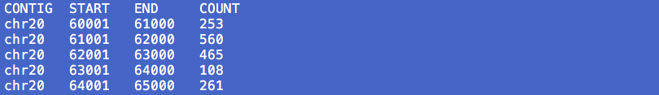
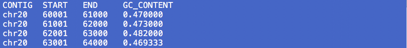
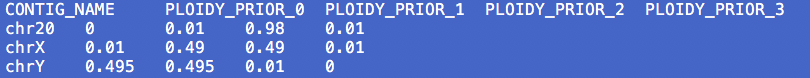
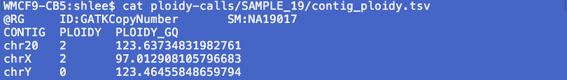
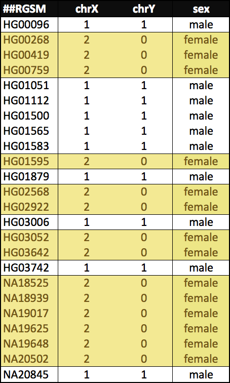
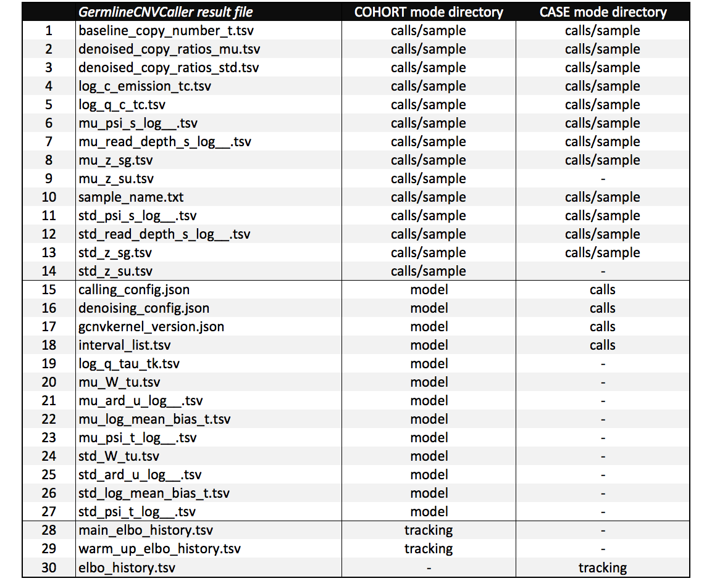
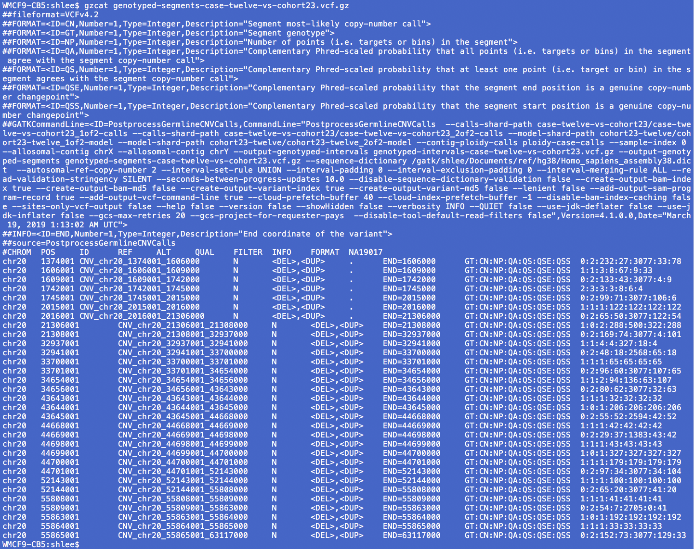

# (How to) Call common and rare germline copy number variants

by Soo Hee Lee

_20190331-9PM draft_ 

**Document is in `BETA`. It may be incomplete and/or inaccurate. Post suggestions and read about updates in the _Comments_ section.**

---
[](images-gcnv/gcnv_workflow_diagram_20190321_sooheelee.png) 

The tutorial outlines steps in detecting _germline_ copy number variants (gCNVs) and illustrates two workflow modes--**cohort mode** and **case mode**. The _cohort mode_ simultaneously generates a cohort model and calls CNVs for the cohort samples. The _case mode_ analyzes a single sample against an already constructed cohort model. The same workflow steps apply to both targeted exome and whole genome sequencing (WGS) data. The workflow is able to call both _rare_ and _common_ events and intelligently handles allosomal ploidies, i.e. cohorts of mixed male and female samples. 

For the _cohort mode_, the general recommendation is at least a hundred samples to start. Researchers should expect to tune workflow parameters from the provided defaults. In particular, GermlineCNVCaller's default inference parameters are conservatively set for efficient run times. 

The figure diagrams the workflow tools. **Section 1** creates an intervals list and counts read alignments overlapping the intervals. **Section 2** shows optional but recommended _cohort mode_ steps to annotate intervals with covariates for use in filtering intervals as well as for use in explicit modeling. The section also removes outlier counts intervals. **Section 3** generates global baseline observations for the data and models and calls the ploidy of each contig. **Section 4** is at the heart of the workflow and models per-interval copy number. Because of the high intensity of compute model fitting requires, the section shows how to analyze data in parts. Finally, **Section 5** calls per-sample copy number events per interval and per segment. Results are in VCF format.  

► A highly recommended [whitepaper detailing the methods](https://github.com/broadinstitute/gatk/blob/master/docs/CNV/germline-cnv-caller-model.pdf) is in the gatk GitHub repository's [docs/CNV](https://github.com/broadinstitute/gatk/tree/master/docs/CNV) directory. 
► For pipelined workflows, see the [gatk GitHub](https://github.com/broadinstitute/gatk) repository's [scripts/cnv_wdl](https://github.com/broadinstitute/gatk/tree/master/scripts/cnv_wdl) directory. Be sure to obtain a tagged version of the script, e.g. [v4.1.0.0](https://github.com/broadinstitute/gatk/tree/4.1.0.0/scripts/cnv_wdl/germline), following instructions in [Section 4 of Article#23405](https://software.broadinstitute.org/gatk/documentation/article?id=23405#4).
► This workflow is not appropriate for bulk tumor samples, as it infers absolute copy numbers. For somatic copy number alteration calling, see [Tutorial#11682](https://software.broadinstitute.org/gatk/documentation/article?id=11682).

[Blog#XXX]() visualizes the results in IGV and provides followup discussion. Towards data exploration, here are two illustrative _Jupyter Notebook_ reports that dissect the results. 

- [Notebook#11685](https://gatkforums.broadinstitute.org/gatk/discussion/11685/) shows an approach to measuring concordance of sample NA19017 gCNV calls to _1000 Genomes Project_ truth set calls using tutorial `chr20sub` small data.
- [Notebook#11686](https://gatkforums.broadinstitute.org/gatk/discussion/11686/) examines gCNV callset annotations using larger data, namely chr20 gCNV results from the tutorial's 24-sample cohort.  

<a name="top"></a>

---
### Jump to a section
1. [Collect raw counts data with PreprocessIntervals and CollectFragmentCounts](#1)

    ☞ [1.1 How do I view HDF5 format data?](https://gatkforums.broadinstitute.org/dsde/discussion/11682#1.1)
2. [(Optional) Annotate intervals with features and subset regions of interest with FilterIntervals](#2)
3. [Call autosomal and allosomal contig ploidy with DetermineGermlineContigPloidy](#3)
4. [Model interval copy number for a cohort or case sample with GermlineCNVCaller](#4)

    ☞ [4.1 How do I increase the sensitivity of detection?](#4.1)
    ☞ [4.2 How do I make interval lists for scattering?](#4.2)
    
5. [Call copy number segments and consolidate sample results with PostprocessGermlineCNVCalls](#5)

<a name="tools"></a>
 
---
### Tools involved
- GATK 4.1.0.0 
- [](images-gcnv/wikimedia_commons_python_logo_green.svg.png) Workflow tools DetermineGermlineContigPloidy, GermlineCNVCaller and PostprocessGermlineCNVCalls require a Python environment with specific packages, e.g. the gCNV computational python module _gcnvkernel_. See [Article#12836](https://software.broadinstitute.org/gatk/documentation/article?id=12836) for instructions on setting up and managing the environment with the user-friendly _conda_. Once the _conda_ environment is set up, e.g. with `conda env create -f gatkcondaenv.yml`, activate it with `source activate gatk` or `conda activate gatk` before running the tool. 

    Alternatively, use the [broadinstitute/gatk Docker](https://hub.docker.com/r/broadinstitute/gatk/), which activates the Python environment by default. Allocation of at least 8GB memory to Docker is recommended for the tutorial commands. See [Article#11090](https://gatkforums.broadinstitute.org/gatk/discussion/11090) for instructions to launch a Docker container.

### Download example data
The tutorial provides example small WGS data sourced from the _1000 Genomes Project_. _Cohort mode_ illustrations use 24 samples, while _case mode_ illustrations analyze one sample against a cohort model made from the remaining 23 samples. _The tutorial uses a fraction of the workflow's recommended hundred samples for ease of illustration._ Furthermore, commands in each step use one of three differently sized intervals lists for efficiency. Coverage data are from the entirety of chr20, chrX and chrY. So although a step may analyze a subset of regions, it is possible to instead analyze all three contigs in _case_ or _cohort modes_.

Download **tutorial_XXX.tar.gz** either from the [GoogleDrive](https://drive.google.com/open?id=1JnZn5jLQs3kwg6EToeoH8J4kl2Vn69YH) or from the [FTP site](ftp://gsapubftp-anonymous@ftp.broadinstitute.org/tutorials/datasets). To access the ftp site, leave the password field blank. If the GoogleDrive link is broken, please let us know. The tutorial also requires the GRCh38 reference FASTA, dictionary and index. These are available from the [GATK Resource Bundle](https://software.broadinstitute.org/gatk/download/bundle). The example data is from the [1000 Genomes project](http://www.internationalgenome.org/) Phase 3 aligned to GRCh38. 

<a name="1"></a>

----
## 1. Collect raw counts data with PreprocessIntervals and CollectReadCounts
[PreprocessIntervals](https://software.broadinstitute.org/gatk/documentation/tooldocs/current/org_broadinstitute_hellbender_tools_copynumber_PreprocessIntervals.php) pads exome targets and bins WGS intervals. Binning refers to creating equally sized intervals across the reference. For example, 1000 base binning would define chr1:1-1000 as the first bin. Because counts of reads on [reference `N` bases](https://gatkforums.broadinstitute.org/gatk/discussion/7857) are not meaningful, the tool automatically excludes bins with all `N`s. For GRCh38 chr1, non-N sequences start at base 10,001, so the first few bin become: 

[](images-gcnv/gcnv_terminal_nonN_intervals_2019-03-30_sooheelee.png) 

**For WGS data, bin entirety of reference, e.g. with 1000 base intervals.**

```
gatk PreprocessIntervals \
-R ~/ref/Homo_sapiens_assembly38.fasta \
--padding 0 \
-imr OVERLAPPING_ONLY \
-O grch38.preprocessed.interval_list
```
This produces a Picard-style intervals list of 1000 base bins.

**For exome data, pad target regions, e.g. with 250 bases.**

```
gatk PreprocessIntervals \
-R ~/ref/Homo_sapiens_assembly38.fasta \
-L targets.interval_list \
--bin-length 0 \
-imr OVERLAPPING_ONLY \
-O targets.preprocessed.interval_list
```
This produces a Picard-style intervals list of exome target regions padded by 250 bases on either side.

**For the tutorial, bins three contigs.**

The contigs in `gcnv.list` subset the reference to chr20, chrX and chrY.

```
gatk PreprocessIntervals \
-R ref/Homo_sapiens_assembly38.fasta \
--padding 0 \
-L gcnv.list \
-imr OVERLAPPING_ONLY \
-O chr20XY.interval_list
```

This generates a Picard-style intervals list with 242,549 intervals. The file has a header section with `@` header lines and a five-column body. See [Article#11009](https://gatkforums.broadinstitute.org/gatk/discussion/11009) for a description of the columns.

**Comments on select parameters**

- For WGS, the default 1000 `--bin-length` is the recommended starting point for typical 30x data. Be sure to set `--interval-padding 0` to disable padding into N-regions. Bin size should correlate with depth of coverage, e.g. lower coverage data should use larger bin size while higher coverage data can support smaller bin size. The size of the bin defines the resolution of CNV calls. The factors to consider in sizing include how noisy the data is, average coverage depth and how even coverage is across the reference.  
- For targeted exomes, provide the exome capture kit's target intervals with `-L`, set `--bin-length 0` to disable binning and pad the intervals with `--interval-padding 250` or other desired length. 
- Provide intervals to exclude from analysis with `--exclude-intervals` or `-XL`, e.g. centromeric regions. Consider using this option especially if data is aligned to a reference other than GRCh38. The workflow enables excluding regions later again using `-XL`. A frugal strategy is to collect read counts using the entirety of intervals and then to exclude undesirable regions later at the FilterIntervals step ([section 2](#2)), the DetermineGermlineContigPloidy step ([section 3](#3)), at the GermlineCNVCaller step ([section 5](#5)) and/or post-calling.

---
[CollectReadCounts](https://software.broadinstitute.org/gatk/documentation/tooldocs/current/org_broadinstitute_hellbender_tools_copynumber_CollectReadCounts.php) tabulates the raw integer counts of reads overlapping an interval. The tutorial has already collected read counts ahead of time for the three contigs--chr20, chrX and chrY. Here, we collect read counts on small data.

**Count reads per bin using CollectReadCounts**

```
gatk CollectReadCounts \
-L chr20sub.interval_list \
-R ref/Homo_sapiens_assembly38.fasta \
-imr OVERLAPPING_ONLY \
-I NA19017.chr20sub.bam \
--format TSV \
-O sandbox/2_NA19017.tsv 
```

This generates a TSV format table of read counts. 

**Comments on select parameters**

- The tutorial generates text-based TSV (tab-separated-value) format data instead of the default [HDF5 format](https://software.broadinstitute.org/gatk/documentation/article?id=11508) by adding `--format TSV` to the command. Omit this option to generate the default HDF5 format. Downstream tools process HDF5 format more efficiently. 
- Here and elsewhere in the workflow, set `--interval-merging-rule` (`-imr`) to `OVERLAPPING_ONLY`, to prevent the tool from merging abutting intervals. 
- The tool employs a number of engine-level read filters. Of note are [NotDuplicateReadFilter](https://software.broadinstitute.org/gatk/documentation/tooldocs/current/org_broadinstitute_hellbender_engine_filters_ReadFilterLibrary$NotDuplicateReadFilter.php) and [MappingQualityReadFilter](https://software.broadinstitute.org/gatk/documentation/tooldocs/current/org_broadinstitute_hellbender_engine_filters_MappingQualityReadFilter.php). This means the tool excludes reads marked as duplicate and excludes reads with mapping quality less than 10. Change the mapping quality threshold with the `--minimum-mapping-quality` option. 

After the header section, denoted by lines starting with `@`, the body of the data has a column header line followed by read counts for every interval.

[](images-gcnv/gcnv_terminal_collectreadcounts_2019-03-30_sooheelee.png) 

<a name="1.1"></a>
### ☞ 1.1 How do I view HDF5 format data?
See [Article#11508](https://software.broadinstitute.org/gatk/documentation/article?id=11508) for an overview of the format and instructions on how to navigate the data with external application _HDFView_. The article illustrates features of the format using data generated in another tutorial.

<a name="2"></a>
[back to top](#top)

---
## 2. (Optional) Annotate intervals with features and subset regions of interest with FilterIntervals
The steps in this section pertain to the _cohort mode_. 

Researchers may desire to subset the intervals that GermlineCNVCaller will analyze, either to exclude potentially problematic regions or to retain only regions of interest. For example one may wish to exclude regions where all samples in a large cohort have copy number zero. Filtering intervals can be especially impactful for analyses that utilize references other than GRCh38 or that are based on sequencing technologies affected by sequence context, e.g. targeted exomes. The tutorial data is WGS data aligned to GRCh38, and the gCNV workflow can process the entirety of the data, without the need for any interval filtering. 

Towards deciding which regions to exclude, [AnnotateIntervals](https://software.broadinstitute.org/gatk/documentation/tooldocs/current/org_broadinstitute_hellbender_tools_copynumber_AnnotateIntervals.php) labels the given intervals with GC content and additionally with mappability and segmental duplication content if given the respective optional resource files. [FilterIntervals](https://software.broadinstitute.org/gatk/documentation/tooldocs/current/org_broadinstitute_hellbender_tools_copynumber_FilterIntervals.php) then subsets the intervals list based on the annotations and other tunable thresholds. Later, GermlineCNVCaller also takes in the annotated intervals to use as covariates towards analysis.

_Explicit GC-correction, although optional, is recommended._ The default v4.1.0.0 `cnv_germline_cohort_workflow.wdl` pipeline script omits explicit gc-correction and we activate it in the pipeline by setting `do_explicit_gc_correction":"True"`. The tutorial illustrates the optional AnnotateIntervals step by performing the recommended explicit GC-content-based filtering.

**AnnotateIntervals with GC content**

```	
gatk AnnotateIntervals \
-L chr20XY.interval_list \
-R ref/Homo_sapiens_assembly38.fasta \
-imr OVERLAPPING_ONLY \
-O chr20XY.annotated.tsv
```

This produces a four-column table where the fourth column gives the fraction of GC content.

[](images-gcnv/gcnv_terminal_annotateintervals_2019-03-30_sooheelee.png) 

**Comments on select parameters**

- The tool requires the `-R` reference and the `-L` intervals. The tool calculates GC-content for the intervals using the reference.
- Although optional for the tool, we recommend annotating mappability by providing a `--mappability-track` regions file in either `.bed` or `.bed.gz` format. Be sure to merge any overlapping intervals beforehand. The tutorial omits use of this resource.

    GATK recommends use of the the single-read mappability track, as the multi-read track requires much longer times to process. For example, the Hoffman lab at the University of Toronto provides human and mouse mappability BED files for various kmer lengths at [https://bismap.hoffmanlab.org/](https://bismap.hoffmanlab.org/). The accompanying publication is titled [_Umap and Bismap: quantifying genome and methylome mappability_](https://doi.org/10.1093/nar/gky677).
    
- Optionally and additionally, annotate segmental duplication content by providing a `--segmental-duplication-track` regions file in either `.bed` or `.bed.gz` format. 
- Exclude undesirable intervals with the `-XL` parameter, e.g. intervals corresponding to centromeric regions. 

---

[FilterIntervals](https://software.broadinstitute.org/gatk/documentation/tooldocs/current/org_broadinstitute_hellbender_tools_copynumber_FilterIntervals.php) requires preprocessed intervals and will optionally and additionally take three other resources towards filtering: (i) intervals to exclude, (ii) annotated intervals to activate annotation-based filters and (iii) read counts to activate count-based filters. When given both annotated intervals and read counts, the tool retains the intervals that intersect from filtering on each data type. The v4.1.0.0 `cnv_germline_cohort_workflow.wdl` pipeline script requires read counts files, and so by default the pipeline script always performs the FilterIntervals step on read counts.

**FilterIntervals based on GC-content and cohort extreme counts**

```
gatk FilterIntervals \
-L chr20XY.interval_list \
--annotated-intervals chr20XY.annotated.tsv \
-I cvg/HG00096.tsv -I cvg/HG00268.tsv -I cvg/HG00419.tsv -I cvg/HG00759.tsv \
-I cvg/HG01051.tsv -I cvg/HG01112.tsv -I cvg/HG01500.tsv -I cvg/HG01565.tsv \
-I cvg/HG01583.tsv -I cvg/HG01595.tsv -I cvg/HG01879.tsv -I cvg/HG02568.tsv \
-I cvg/HG02922.tsv -I cvg/HG03006.tsv -I cvg/HG03052.tsv -I cvg/HG03642.tsv \
-I cvg/HG03742.tsv -I cvg/NA18525.tsv -I cvg/NA18939.tsv -I cvg/NA19017.tsv \
-I cvg/NA19625.tsv -I cvg/NA19648.tsv -I cvg/NA20502.tsv -I cvg/NA20845.tsv \
-imr OVERLAPPING_ONLY \
-O chr20XY.cohort.gc.filtered.interval_list
```

This produces a [Picard-style intervals list](https://software.broadinstitute.org/gatk/documentation/article?id=11009) containing a subset of the starting intervals (230,126 of 242,549). Of the filtered intervals, low GC-content filters 42 intervals, and extreme coverage counts from the 24-sample cohort remove an additional 12,381 intervals for a total of 12,423 removed filtered intervals (5.122% of starting). 

**Comments on select parameters**    
  
- The tool requires the preprocessed intervals, provided with `-L`, from [Section 1](#1).       
- Given annotated intervals with `--annotated-intervals`, the tool filters intervals on the given annotation(s). 

    - GC-content thresholds are set by `--minimum-gc-content` and `--maximum-gc-content`, where defaults are 0.1 and 0.9, respectively. 
    - Mappability thresholds are set by `--minimum-mappability` and `--maximum-mappability`. Defaults are 0.9 and 1.0, respectively. 
    - Segmental duplication content thresholds are set by `--minimum-segmental-duplication-content` and `--maximum-segmental-duplication-content`. Defaults are 0.0 and 0.5, respectively. 
- Given read counts files, each with `-I` and in either HDF5 or TSV format, the tool filters intervals on low and extreme read counts with the following tunable thresholds.  

	- `--low-count-filter-count-threshold` default is 5
	- `--low-count-filter-percentage-of-samples` default is 90.0
	- `--extreme-count-filter-minimum-percentile` default is 1.0
	- `--extreme-count-filter-maximum-percentile` default is 99.0
	- `--extreme-count-filter-percentage-of-samples` default is 90.0

	The read counts data must match each other in intervals. 
	
	For the default parameters, the tool first filters intervals with a count less than 5 in greater than 90% of the samples. The tool then filters _the remaining_ intervals with a count percentile less than 1 or greater than 99 in a percentage of samples greater than 90%. These parameters effectively exclude intervals where all samples have extreme outlier counts, e.g. are deleted.
	
	To disable counts based filtering, omit the read counts or, e.g. when using the v4.1.0.0 `cnv_germline_cohort_workflow.wdl` pipeline script, set the two `percentage-of-samples` parameters as follows.
	
	```
	--low-count-filter-percentage-of-samples 100 \
	--extreme-count-filter-percentage-of-samples 100 \
	```
- Provide intervals to exclude from analysis with `--exclude-intervals` or `-XL`, e.g. centromeric regions. A frugal strategy is to collect read counts using the entirety of intervals and then to exclude undesirable regions later at the FilterIntervals step ([section 2](#2)), the DetermineGermlineContigPloidy step ([section 3](#3)), at the GermlineCNVCaller step ([section 5](#5)) and/or post-calling.

<a name="3"></a>
[back to top](#top)

---
## 3. Call autosomal and allosomal contig ploidy with DetermineGermlineContigPloidy 
[DetermineGermlineContigPloidy](https://software.broadinstitute.org/gatk/documentation/tooldocs/current/org_broadinstitute_hellbender_tools_copynumber_DetermineGermlineContigPloidy.php) calls contig level ploidies for both autosomal, e.g. human chr20, and allosomal contigs, e.g. human chrX. The tool determines baseline contig ploidies using sample coverages and _contig ploidy priors_ that give the prior probabilities for each ploidy state for each contig. In this process, the tool generates global baseline coverage and noise data GermlineCNVCaller will use in [section 5](#5).

_The tool determines baseline contig ploidies using the total read count per contig_. Researchers should consider the impact of this for their data. For example, for the tutorial WGS data, the contribution of the PAR regions to total coverage counts on chrX is small and the tool correctly calls allosomal ploidies. However, consider blacklisting PAR regions for data where the contribution is disporportionate, e.g. targeted panels. 

[](#tools)&nbsp;**DetermineGermlineContigPloidy in COHORT MODE**

The _cohort_ mode requires a `--contig-ploidy-priors` table and produces a ploidy model. 

```
gatk DetermineGermlineContigPloidy \
-L chr20XY.cohort.gc.filtered.interval_list \
--interval-merging-rule OVERLAPPING_ONLY \
-I cvg/HG00096.tsv -I cvg/HG00268.tsv -I cvg/HG00419.tsv -I cvg/HG00759.tsv \
-I cvg/HG01051.tsv -I cvg/HG01112.tsv -I cvg/HG01500.tsv -I cvg/HG01565.tsv \
-I cvg/HG01583.tsv -I cvg/HG01595.tsv -I cvg/HG01879.tsv -I cvg/HG02568.tsv \
-I cvg/HG02922.tsv -I cvg/HG03006.tsv -I cvg/HG03052.tsv -I cvg/HG03642.tsv \
-I cvg/HG03742.tsv -I cvg/NA18525.tsv -I cvg/NA18939.tsv -I cvg/NA19017.tsv \
-I cvg/NA19625.tsv -I cvg/NA19648.tsv -I cvg/NA20502.tsv -I cvg/NA20845.tsv \
--contig-ploidy-priors chr20XY_contig_ploidy_priors.tsv \
--output . \
--output-prefix ploidy \
--verbosity DEBUG
```
This produces a `ploidy-calls` directory and a `ploidy-model` directory. The `ploidy-calls` directory contains a folder of data for each sample in the cohort including the contig ploidy calls. Each sample directory, e.g. `ploidy-calls/SAMPLE_0`, contains five files. 

1. `contig_ploidy.tsv` notes the ploidy and genotype quality (GQ) of the ploidy call for each contig.
2. `global_read_depth.tsv` notes an average depth value and an average ploidy across all the intervals of the sample.
3. `mu_psi_s_log__.tsv` captures the posterior mean for all of the modeled parameters.
4. `sample_name.txt` contains the readgroup sample (RG SM) name.
5. `std_psi_s_log__.tsv` captures the standard deviation for all of the modeled paramters.

The `ploidy-model` directory contains aggregated model data for the cohort. This is the model to provide to a case-mode DetermineGermlineContigPloidy analysis and to GermlineCNVCaller. The tutorial `ploidy-model` directory contains the eight files as follows.

1. `contig_ploidy_prior.tsv` is a copy of the ploidy priors given to the tool.
2. `gcnvkernel_version.json` notes the version of the kernel.
3. `interval_list.tsv` recapitulates the intervals used, e.g. the filtered intervals.
4. `mu_mean_bias_j_lowerbound__.tsv`
5. `mu_psi_j_log__.tsv`
6. `ploidy_config.json`
7. `std_mean_bias_j_lowerbound__.tsv`
8. `std_psi_j_log__.tsv`

The _theano_ model automatically generates `mu_` and `std_` files and may append transformations it performs to the file name, e.g. `log` or `lowerbound` as we see above. These are likely of interest only to advanced users.

---
[](#tools)&nbsp;**DetermineGermlineContigPloidy in CASE MODE**

The _case_ mode calls contig ploidies for each sample against the ploidy model given by `--model`. The following command runs sample NA19017 against a 23-sample cohort model.

```
gatk DetermineGermlineContigPloidy \
--model cohort-23wgs-20190213-contig-ploidy-model \
-I cvg/NA19017.tsv \
-O . \
--output-prefix ploidy-case \
--verbosity DEBUG
```
This produces a `ploidy-case-calls` directory, which in turn contains a directory of sample data, `SAMPLE_0`. A list of the five resulting files is some paragraphs above.

**Comments on select parameters**    

- It is possible to analyze multiple samples simultaneously in a _case mode_ command. Provide each sample with `-I`.   
- For the `-L` intervals, supply the most processed intervals list. For the tutorial, this is the filtered intervals. Note the _case mode_ does not require explicit intervals because the ploidy model provides them. 
- Provide a `--contig-ploidy-priors` table containing the per-contig prior probabilities for integer ploidy state. Again, the _case mode_ does not require an explicit priors file as the ploidy model provides them. [Tool documentation](https://software.broadinstitute.org/gatk/documentation/tooldocs/current/org_broadinstitute_hellbender_tools_copynumber_DetermineGermlineContigPloidy.php) describes this resource in detail. The tutorial uses the following contig ploidy priors.  
- Optionally provide intervals to exclude from analysis with `--exclude-intervals` or `-XL`, e.g. [pseudoautosomal (PAR) regions](https://gatkforums.broadinstitute.org/gatk/discussion/7857/reference-genome-components), which can skew results for certain data. 

    [](images-gcnv/gcnv_terminal_determinegermlinecontigploidy_2019-03-30_sooheelee.png)

The results for NA19017, from either the _cohort mode_ or the case mode, show ploidy 2 for chr20 and chrX and ploidy 0 for chrY. The PLOIDY_GQ quality metrics differ slightly for the modes. The entirety of NA19017's `contig_ploidy.tsv` is shown.

[](images-gcnv/gcnv_terminal_determinegermlinecontigploidy_calls_2019-03-30_sooheelee.png)

Checking the ploidy calls for each of the 24 samples against metadata confirms expectations. The following table summarizes results for the 24 samples. The data was collated from DetermineGermlineContigPloidy results using a [bashscript](scripts/gcnvTabulateSex.sh). 

[](images-gcnv/gcnv_cohort24_sex_2019-03-30_sooheelee.png)

> It should be noted, the tutorial's default parameter run gives XY samples CN1 for the majority of chrX, _including for PAR regions_, where coverage is actually on par with the CN2 of XX samples. See [Blog#XXX]() for further discussion. 

<a name="4"></a>
[back to top](#top)

---
## 4. Call copy number variants with GermlineCNVCaller
[GermlineCNVCaller](https://software.broadinstitute.org/gatk/documentation/tooldocs/current/org_broadinstitute_hellbender_tools_copynumber_GermlineCNVCaller.php) learns a denoising model per scattered shard while consistently calling CNVs across the shards. The tool models systematic biases and CNVs simultaneously, which allows for sensitive detection of both rare and common CNVs. For a description of innovations, see [Blog#23439](https://software.broadinstitute.org/gatk/blog?id=23439).

As the [tool documentation](https://software.broadinstitute.org/gatk/documentation/tooldocs/current/org_broadinstitute_hellbender_tools_copynumber_GermlineCNVCaller.php) states under _Important Remarks_ (v4.1.0.0), the tool should see data from a large enough genomic region so as to be exposed to diverse genomic features. _The current recommendation is to provide at least ~10–50Mbp genomic coverage per scatter._ This applies to exomes or WGS. This allows reliable inference of bias factors including GC bias. The limitation of analyzing larger regions is available memory. As an analysis covers more data, memory requirements increase. 

For expediency, the tutorial commands below analyze small data, specifically the 1400 bins in `twelveregions.cohort.gc.filtered.interval_list` and use default parameters. The tutorial splits the 1400 bins into two shards with 700 bins each to illustrate scattering. This results in ~0.7Mbp genomic coverage per shard. See [section 4.2](#4.2) for how to split interval lists by a given number of intervals. Default inference parameters are conservatively set for efficient run times. 

> The tutorial coverage data are sufficient to analyze the ~15Mb in  `chr20sub.cohort.gc.filtered.interval_list` as well as the entirety of chr20, chrX and chrY using the ~230Mb of `chr20XY.cohort.gc.filtered.interval_list`. The former, at 5K bins per shard, give three shards. When running the default parameters in a GATKv4.1.0.0 Docker locally on a MacBook Pro, each cohort-mode shard analysis takes ~20 minutes. The latter gives 46 shards at 5K bins per shard. When running the default parameters of the v4.1.0.0 WDL cohort-mode workflow on the cloud, the majority of the shard analyses complete in half an hour.     

[](#tools)&nbsp;**GermlineCNVCaller in COHORT MODE**

Call gCNVs on the 24-sample cohort in _two_ scatters. Notice the different `-L` intervals and `--output-prefix` basenames. 

```
gatk GermlineCNVCaller \
--run-mode COHORT \
-L scatter-sm/twelve_1of2.interval_list \
-I cvg/HG00096.tsv -I cvg/HG00268.tsv -I cvg/HG00419.tsv -I cvg/HG00759.tsv \
-I cvg/HG01051.tsv -I cvg/HG01112.tsv -I cvg/HG01500.tsv -I cvg/HG01565.tsv \
-I cvg/HG01583.tsv -I cvg/HG01595.tsv -I cvg/HG01879.tsv -I cvg/HG02568.tsv \
-I cvg/HG02922.tsv -I cvg/HG03006.tsv -I cvg/HG03052.tsv -I cvg/HG03642.tsv \
-I cvg/HG03742.tsv -I cvg/NA18525.tsv -I cvg/NA18939.tsv -I cvg/NA19017.tsv \
-I cvg/NA19625.tsv -I cvg/NA19648.tsv -I cvg/NA20502.tsv -I cvg/NA20845.tsv \
--contig-ploidy-calls ploidy-calls \
--annotated-intervals twelveregions.annotated.tsv \
--interval-merging-rule OVERLAPPING_ONLY \
--output cohort24-twelve \
--output-prefix cohort24-twelve_1of2 \
--verbosity DEBUG
```

```
gatk GermlineCNVCaller \
--run-mode COHORT \
-L scatter-sm/twelve_2of2.interval_list \
-I cvg/HG00096.tsv -I cvg/HG00268.tsv -I cvg/HG00419.tsv -I cvg/HG00759.tsv \
-I cvg/HG01051.tsv -I cvg/HG01112.tsv -I cvg/HG01500.tsv -I cvg/HG01565.tsv \
-I cvg/HG01583.tsv -I cvg/HG01595.tsv -I cvg/HG01879.tsv -I cvg/HG02568.tsv \
-I cvg/HG02922.tsv -I cvg/HG03006.tsv -I cvg/HG03052.tsv -I cvg/HG03642.tsv \
-I cvg/HG03742.tsv -I cvg/NA18525.tsv -I cvg/NA18939.tsv -I cvg/NA19017.tsv \
-I cvg/NA19625.tsv -I cvg/NA19648.tsv -I cvg/NA20502.tsv -I cvg/NA20845.tsv \
--contig-ploidy-calls ploidy-calls \
--annotated-intervals twelveregions.annotated.tsv \
--interval-merging-rule OVERLAPPING_ONLY \
--output cohort24-twelve \
--output-prefix cohort24-twelve_2of2 \
--verbosity DEBUG
```

This produces per-interval gCNV calls for each of the cohort samples and a gCNV model for the cohort. Each command produces three directories within `cohort24-twelve`: a `cohort24-twelve_1of2-calls` folder of per sample gCNV call results, a `cohort24-twelve_1of2-model` folder of cohort model data and a `cohort24-twelve_1of2-tracking` folder of data that tracks model fitting. The table below lists the _cohort mode_ data files alongside _case mode_ files.

---
[](#tools)&nbsp;**GermlineCNVCaller in CASE MODE**

Call gCNVs on a sample against a cohort model. The case analysis must use the same scatter approach as the model generation. So, as above, we run two shard analyses. Here, `--model` and `--output-prefix` differ between the scatter the commands.  

```
gatk GermlineCNVCaller \
--run-mode CASE \
-I cvg/NA19017.tsv \
--contig-ploidy-calls ploidy-case-calls \
--model cohort23-twelve/cohort23-twelve_1of2-model \
--output case-twelve-vs-cohort23 \
--output-prefix case-twelve-vs-cohort23_1of2 \
--verbosity DEBUG
```   
```
gatk GermlineCNVCaller \
--run-mode CASE \
-I cvg/NA19017.tsv \
--contig-ploidy-calls ploidy-case-calls \
--model cohort23-twelve/cohort23-twelve_2of2-model \
--output case-twelve-vs-cohort23 \
--output-prefix case-twelve-vs-cohort23_2of2 \
--verbosity DEBUG
```

This produces both `calls` and `tracking` folders with, e.g. the `case-twelve-vs-cohort23_1of2` basename. The `case-twelve-vs-cohort23_1of2-calls` folder contains case sample gCNV call results and the `case-twelve-vs-cohort23_1of2-tracking` folder contains model fitting results. The _case mode_ results files are listed in the table below alongside _cohort mode_ data files.

[](images-gcnv/gcnv_germlinecnvcaller_30_files_2019-03-30_sooheelee.png) 

**Comments on select parameters**    

- The `-O` output directory must be extant before running the command. Future releases (v4.1.1.0) will create the directory.
- The default `--max-copy-number` is capped at 5. This means the tool reports any events with more copies as CN5.
- For the _cohort mode_, optionally provide `--annotated-intervals` to include the annotations as covariates. These must contain all of the `-L` intervals. The `-L` intervals is an exact match or a subset of the annotated intervals.
- For the _case mode_, the tool accepts only a single `--model` directory at a time. So the case must be analyzed with the same number of scatters as the cohort model run. The _case mode_ parameters appear fewer than the _cohort mode_ because the `--model` directory provides the seemingly missing requirements, i.e. the scatter intervals and the annotated intervals.
- For both modes, provide the `--contig-ploidy-calls` results from DetermineGermlineContigPloidy ([Section 3](#3)). This not only informs ploidy but also establishes baseline coverage and noise levels for each sample. Later, in [section 5](#5), GermlineCNVCaller's shard analyses refer back to these global observations.  
- `--verbosity DEBUG` allows tracking the Python gcnvkernel model fitting in the stdout, e.g. with information on denoising epochs and whether the model converged. The default INFO level verbosity is the next most verbose and emits only GATK Engine level messages. 

At this point, the workflow has done its most heavy lifting to produce data towards copy number calling. In [Section 5](#5), we consolidate the data from the scattered GermlineCNVCaller runs, perform segmentation and call copy number states.

> _One artificial construct of the tutorial is the use of full three contig ploidy calls data even when modeling copy number states for much smaller subset regions. This effectively stabilizes the small analysis._

---
<a name="4.1"></a>
### ☞ 4.1 How do I increase the sensitivity of detection?

The tutorial uses default GermlineCNVCaller modeling parameters. However, researchers should expect to tune parameters for data, e.g. from different sequencing technologies. For tuning, first consider the [_coherence length_](http://singlephoton.wikidot.com/laser-light) parameters, _p-alt_, _p-active_ and the _psi-scale_ parameters. These hyperparameters are just a few of the plethora of adjustable parameters GermlineCNVCaller offers. Refer to the [GermlineCNVCaller tool documentation](https://software.broadinstitute.org/gatk/documentation/tooldocs/current/org_broadinstitute_hellbender_tools_copynumber_GermlineCNVCaller.php) for detailed explanations, and ask on the [GATK Forum](https://gatkforums.broadinstitute.org/gatk/discussions) for further guidance. 

The tutorial illustrates one set of parameter changes for WGS data provided by [@markw](https://gatkforums.broadinstitute.org/gatk/profile/markw) of the GATK SV (_Structural Variants_) team that dramatically increase the sensitivity of calling on the tutorial data. [Blog#XXX]() and [Notebook#11686](https://gatkforums.broadinstitute.org/gatk/discussion/11686/) compare the results of using default vs. the increased-sensitivity parameters. Given the absence of off-the-shelf filtering solutions for CNV calls, when tuning parameters to increase sensitivity, researchers should expect to perform additional due diligence, especially for analyses requiring high precision calls. 

**WGS parameters that increase the sensitivity of calling from [@markw](https://gatkforums.broadinstitute.org/gatk/profile/markw)**

```
--class-coherence-length 1000.0 \
--cnv-coherence-length 1000.0 \
--enable-bias-factors false \
--interval-psi-scale 1.0E-6 \
--log-mean-bias-standard-deviation 0.01 \
--sample-psi-scale 1.0E-6 \
```
    
**Comments on select sensitivity parameters**  

- Decreasing `--class-coherence-length` from its default of 10,000bp to 1000bp decreases the expected length of contiguous segments. Factor for bin size when tuning. 
- Decreasing `--cnv-coherence-length` from its default 10,000bp to 1000bp decreases the expected length of CNV events. Factor for bin size when tuning. 
- Turning off `--enable-bias-factors` from the default `true` state to `false` turns off active discovery of learnable bias factors. This should always be on for targeted exome data and in general can be turned off for WGS data.    
- Decreasing `--interval-psi-scale` from its default of 0.001 to 1.0E-6 reduces the scale the tool considers normal in per-interval noise.
- Decreasing `--log-mean-bias-standard-deviation` from its default of 0.1 to 0.01 reduces what is considered normal noise in bias factors.
- Decreasing `--sample-psi-scale` from its default of 0.0001 to 1.0E-6 reduces the scale that is considered normal in sample-to-sample variance. 

Additional parameters to consider include `--depth-correction-tau`, `--p-active` and `--p-alt`.

- `--depth-correction-tau` has a default of 10000.0 (10K) and defines the precision of read-depth concordance with the global depth value.
- `--p-active` has a default of 1e-2 (0.01) and defines the expected probability of CNV events.
- `p-alt` has a default of 1e-6 (0.000001) and defines the prior probability of CNV states. 

---
<a name="4.2"></a>
### ☞ 4.2 How do I make interval lists for scattering?
This step applies to the _cohort mode_. It is unnecessary for _case mode_ analyses as the model implies the scatter intervals.

The v4.1.0.0 `cnv_germline_cohort_workflow.wdl` pipeline script scatters the GermlineCNVCaller step. Each scattered analysis is on genomic intervals subset from intervals produced either from PreprocessIntervals ([section 1](#1)) or from FilterIntervals ([section 2](#)). The script uses [Picard IntervalListTools](https://software.broadinstitute.org/gatk/documentation/tooldocs/current/picard_util_IntervalListTools.php) to break up the intervals list into _roughly balanced_ lists. 

```
gatk IntervalListTools \
--INPUT chr20sub.cohort.gc.filtered.interval_list \
--SUBDIVISION_MODE INTERVAL_COUNT \
--SCATTER_CONTENT 5000 \
--OUTPUT scatter        
```        

This produces three intervals lists with ~5K intervals each. For the tutorial's 1Kbp bins, this gives ~5Mbp genomic coverage per scatter. Each list is identically named `scattered.interval_list` within its own folder within the `scatter` directory. IntervalListTools systematically names the intermediate folders, e.g. `temp_0001_of_3`, `temp_0002_of_3` and `temp_0002_of_3`. 

**Comments on select parameters**

- The `--SUBDIVISION_MODE INTERVAL_COUNT` mode scatters intervals into similarly sized lists according to the count of intervals regardless of the base count. The tool intelligently breaks up the `chr20sub.cohort.gc.filtered.interval_list`'s ~15K intervals into lists of 5031, 5031 and 5033 intervals. This is preferable to having a fourth interval list with just 95 intervals.
- The tool has another useful feature in the context of the gCNV workflow. To subset `-I` binned intervals, provide the regions of interest with `-SI` (`--SECOND_INPUT`) and use the `--ACTION OVERLAPS` mode to create a new intervals list of the overlapping bins. Adding `--SUBDIVISION_MODE INTERVAL_COUNT --SCATTER_CONTENT 5000` will produce scatter intervals concurrently with the subsetting. 

<a name="5"></a>
[back to top](#top)

---
## 5. Call copy number segments and consolidate sample results with PostprocessGermlineCNVCalls 

[PostprocessGermlineCNVCalls](https://software.broadinstitute.org/gatk/documentation/tooldocs/current/org_broadinstitute_hellbender_tools_copynumber_PostprocessGermlineCNVCalls.php) consolidates the scattered GermlineCNVCaller results, performs segmentation and calls copy number states. The tool generates per-interval and per-segment sample calls in VCF format and runs on a single sample at a time.

[](#tools)&nbsp;**PostprocessGermlineCNVCalls COHORT MODE**

Process a single sample from the 24-sample cohort using the sample index. For NA19017, the sample index is 19. 

```
gatk PostprocessGermlineCNVCalls \
--model-shard-path cohort24-twelve/cohort24-twelve_1of2-model \
--model-shard-path cohort24-twelve/cohort24-twelve_2of2-model \
--calls-shard-path cohort24-twelve/cohort24-twelve_1of2-calls \
--calls-shard-path cohort24-twelve/cohort24-twelve_2of2-calls \
--allosomal-contig chrX --allosomal-contig chrY \
--contig-ploidy-calls ploidy-calls \
--sample-index 19 \
--output-genotyped-intervals genotyped-intervals-cohort24-twelve-NA19017.vcf.gz \
--output-genotyped-segments genotyped-segments-cohort24-twelve-NA19017.vcf.gz \
--sequence-dictionary ref/Homo_sapiens_assembly38.dict
```

[](#tools)&nbsp;**PostprocessGermlineCNVCalls CASE MODE**

NA19017 is the singular sample with index 0.

```
gatk PostprocessGermlineCNVCalls \
--model-shard-path cohort23-twelve/cohort23-twelve_1of2-model \
--model-shard-path cohort23-twelve/cohort23-twelve_2of2-model \
--calls-shard-path case-twelve-vs-cohort23/case-twelve-vs-cohort23_1of2-calls \
--calls-shard-path case-twelve-vs-cohort23/case-twelve-vs-cohort23_2of2-calls \
--allosomal-contig chrX --allosomal-contig chrY \
--contig-ploidy-calls ploidy-case-calls \
--sample-index 0 \
--output-genotyped-intervals genotyped-intervals-case-twelve-vs-cohort23.vcf.gz \
--output-genotyped-segments genotyped-segments-case-twelve-vs-cohort23.vcf.gz \
--sequence-dictionary ref/Homo_sapiens_assembly38.dict
```

Each command generates two VCFs with indices. The `genotyped-intervals` VCF contains variant records for each analysis bin and therefore data covers only the interval regions. For the tutorial's small data, this gives 1400 records. The `genotyped-segments` VCF contains records for each contiguous copy number state segment. For the tutorial's small data, this is 30 and 31 records for _cohort_ and _case mode_ analyses, respectively. 

> _The two modes give highly concordant but slightly different results for sample NA19017. The factor that explains the difference is the contribution of the sample itself to the model._
 
**Comments on select parameters**

- Specify a `--model-shard-path` directory for each scatter of the cohort model.
- Specify a `--calls-shard-path` directory for each scatter of the cohort or case analysis.
- Specify the `--contig-ploidy-calls` directory for the cohort or case analysis.
- By default `--autosomal-ref-copy-number` is set to 2.
- Define allosomal contigs with the `--allosomal-contig` parameter.
- The tool requires specifying the `--output-genotyped-intervals` VCF. 
- Optionally generate segmented VCF results with `--output-genotyped-segments`. The tool segments the regions between the starting bin and the ending bin on a contig. The implication of this is that even if there is a large gap between two analysis bins on the same contig, if the copy number state is equal for the bins, then the bins and the entire region between become a part of the same segment. 
- The `--sample-index` refers to the index number given to a sample by GermlineCNVCaller. In a _case mode_ analysis of a single sample, the index will always be zero.
- The `--sequence-dictionary` is optional. Without it, the tool generates unindexed VCF results. Alternatively, to produce the VCF indices, provide the `-R` reference FASTA or use [IndexFeatureFile](https://software.broadinstitute.org/gatk/documentation/tooldocs/current/org_broadinstitute_hellbender_tools_IndexFeatureFile.php) afterward. The v4.1.0.0 `cnv_germline_cohort_workflow.wdl` pipeline script omits index generation.

Here is the result. The header section with lines starting with `##` gives information on the analysis and define the annotations. Notice the singular `END` annotation in the `INFO` column that denotes the end position of the event. This use of the `END` notation is reminiscent of [GVCF format](https://software.broadinstitute.org/gatk/documentation/article.php?id=4017) GVCF blocks. 

[](images-gcnv/gcnv_terminal_segments_2019-03-30_sooheelee.png)

In the body of the data, as with any VCF, the first two columns give the contig and genomic start position for the variant. The third `ID` column concatenates together `CNV_contig_start_stop`, e.g. `CNV_chr20_1606001_1609000`. The `REF` column is always _N_ and the `ALT` column gives the two types of CNV events of interest in symbolic allele notation--`<DEL>` for deletion and `<DUP>` for duplication or amplification. Again, the `INFO` field gives the `END` position of the variant. The `FORMAT` field lists sample-level annotations `GT:CN:NP:QA:QS:QSE:QSS`. `GT` of 0 indicates normal ploidy, 1 indicates deletion and 2 denotes duplication. The `CN` annotation indicates the copy number state. For the tutorial small data, `CN` ranges from 0 to 3.

For discussion of results, see [Blog#XXX]().

---
[back to top](#top)
