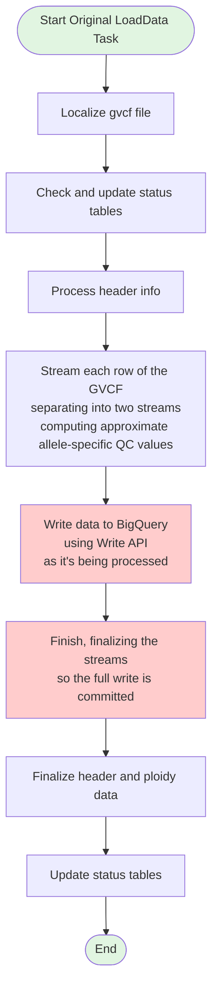
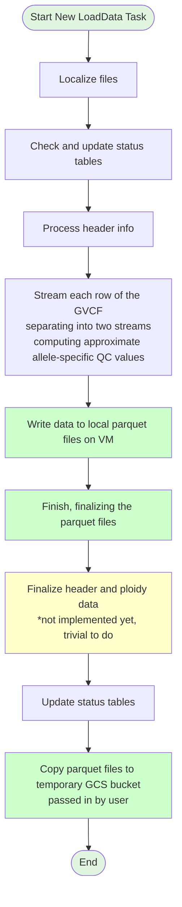

# LoadData Task Comparison: Old vs New Approach

This document compares the original BigQuery Write API approach with the new Parquet-based loading approach for the GVS ingest process.

## Old LoadData Task (BigQuery Write API)

**Key Characteristics:**
- **Direct streaming** to BigQuery using the Write API
- **Synchronous processing** - data written as rows are processed
- **Stream finalization** required to commit the full write
- **Resource intensive** - Write API incurs costs and quota usage
- **Single-phase operation** - ingest and load happen together

---

## New LoadData Task (Parquet-based)

**Key Characteristics:**
- **Local file writing** - data written to parquet files on VM disk
- **Asynchronous processing** - ingest separated from BigQuery loading
- **File-based output** - parquet format enables flexible loading strategies
- **Cost efficient** - avoids expensive Write API, uses batch loading instead
- **Two-phase operation** - ingest produces files, separate task loads to BigQuery
- **Temporary storage** - files staged in GCS bucket for loading

**Note:** Header and ploidy data finalization is not yet implemented in the new flow, but is a trivial addition.

