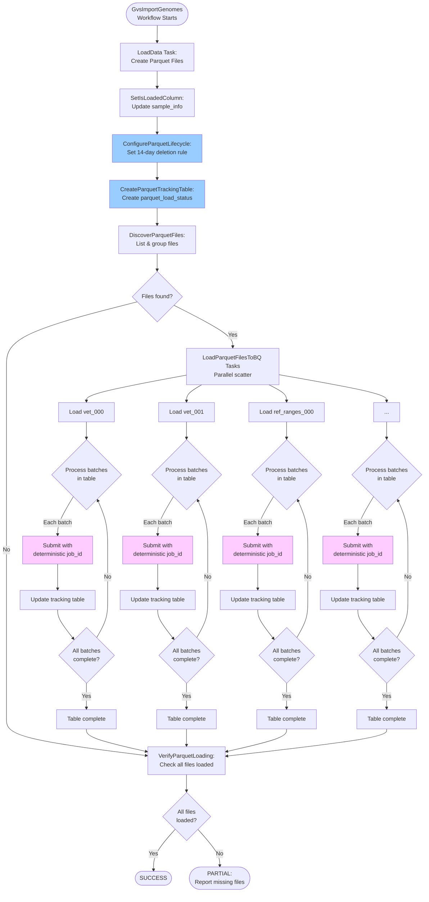
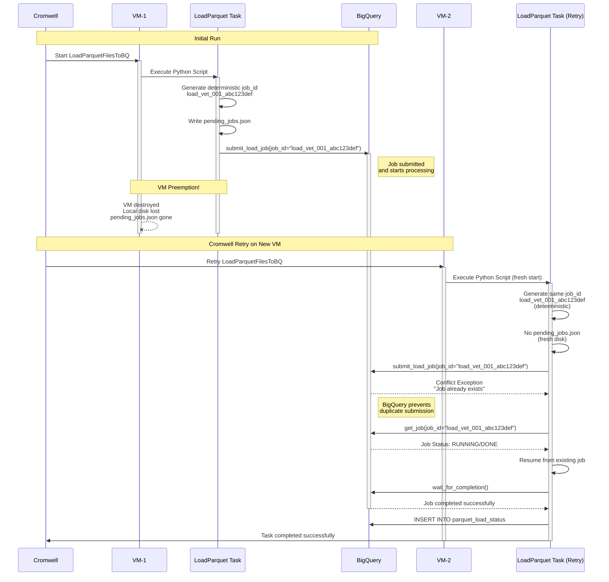
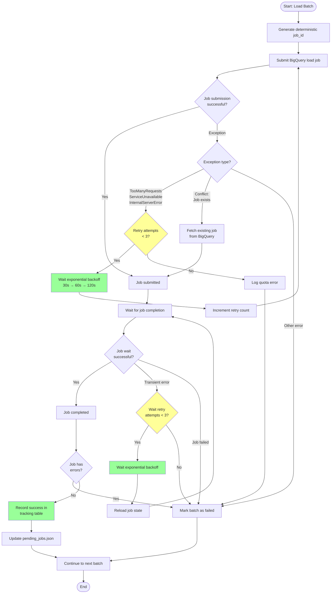
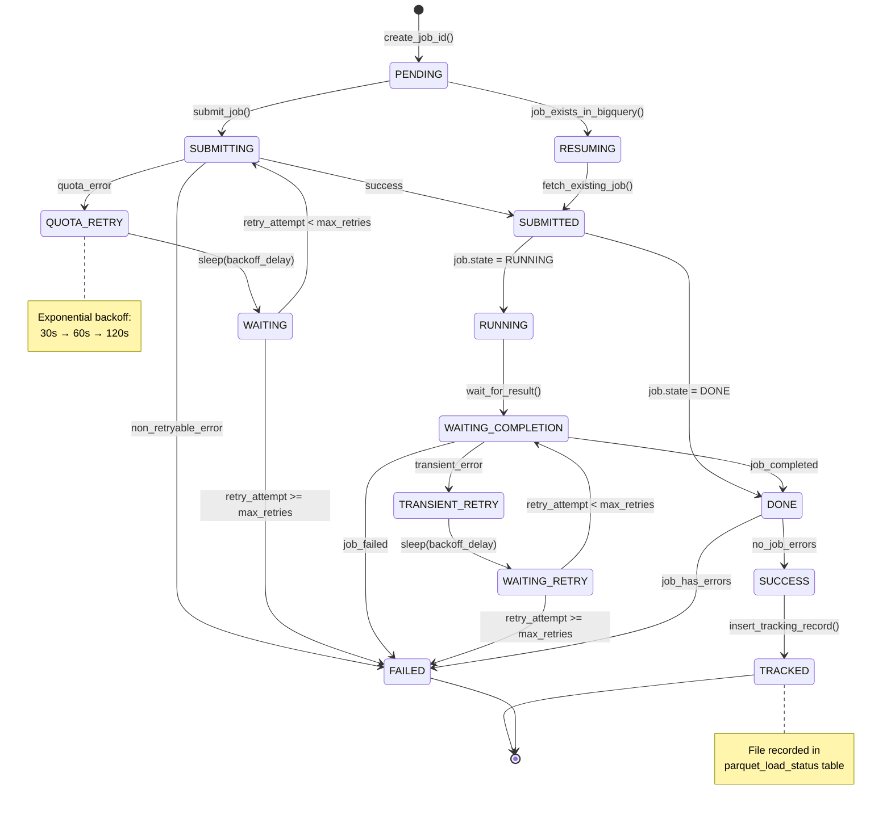

# Fault Tolerance Diagrams for Parquet Loading

## Mermaid Diagrams (GitHub/VS Code Compatible)

### 1. Architecture Diagram - Complete Workflow

```mermaid
flowchart TB
    subgraph Cromwell["Cromwell Workflow Engine"]
        WDL[GvsImportGenomes.wdl]
    end
    
    subgraph LoadDataTask["LoadData Tasks (Parallel)"]
        LD1[Create Parquet Files<br/>Sample 1-N]
        LD2[Create Parquet Files<br/>Sample N+1-2N]
        LD3[...]
    end
    
    subgraph GCS["GCS Storage"]
        VET["vet/000/, vet/001/, ..."]
        REF["ref_ranges/000/, ref_ranges/001/, ..."]
    end
    
    subgraph FaultTolerance["Fault Tolerance Layer"]
        Lifecycle[Configure Lifecycle<br/>14 day cleanup]
        Track[Create Tracking Table<br/>parquet_load_status]
        Discover[Discover Parquet Files<br/>Filter already loaded]
    end
    
    subgraph LoadTasks["LoadParquetFilesToBQ Tasks (Parallel)"]
        LT1[Load vet_000]
        LT2[Load vet_001]
        LT3[Load ref_ranges_000]
        LT4[...]
    end
    
    subgraph RetryLogic["Retry Mechanisms"]
        Det[Deterministic Job IDs<br/>SHA1 hash of batch]
        Quota[Quota Retry<br/>Exponential backoff]
        Local[Local State<br/>pending_jobs.json]
        Persist[Persistent State<br/>BigQuery tracking table]
    end
    
    subgraph BigQuery["BigQuery"]
        Tables[vet_XXX, ref_ranges_XXX<br/>tables]
        TrackTable[parquet_load_status<br/>table]
    end
    
    Verify[Verify All Loaded]
    
    WDL --> LoadDataTask
    LoadDataTask --> GCS
    GCS --> FaultTolerance
    FaultTolerance --> LoadTasks
    LoadTasks --> RetryLogic
    RetryLogic --> BigQuery
    BigQuery --> Verify
    
    style FaultTolerance fill:#9cf
    style RetryLogic fill:#fcf
    style BigQuery fill:#ffc
```

### 2. Complete Workflow - Activity Diagram

---

### 3. Sequence Diagram - VM Preemption Recovery

### 4. Flowchart - Quota Error Handling with Exponential Backoff

### 5. State Diagram - BigQuery Load Job Lifecycle

## Summary

These Mermaid diagrams provide comprehensive visualization of the fault tolerance mechanisms in the parquet loading system:

1. **Architecture Diagram** - Shows the four-layer fault tolerance architecture
2. **Activity Diagram** - Depicts the complete workflow from VCF processing through verification
3. **Sequence Diagram** - Shows VM preemption scenario with deterministic job ID recovery
4. **Flowchart** - Illustrates the complete retry and recovery decision flow
5. **State Diagram** - Tracks the lifecycle of a load job through all possible states

They render natively in GitHub and VS Code with the Markdown Preview Mermaid extension, making them ideal for documentation purposes.
