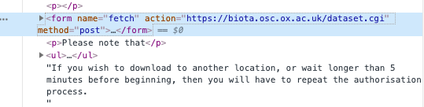

# Overview
Because of how the UK Biobank is set up, injesting data into BigQuery requires a few manual steps:
1.  [Setup](#Setup-instructions)
2.  [Downloading phenotype data](#Downloading-phenotype-data-from-UK-Biobank)
3.  [Decrypting downloaded files](#Decrypting-the-downloaded-files)
4.  [Downloading hesin files](#Downloading-hesin-files)
5.  [Uploading to big query](#BigQuery-ingestion)


# Setup instructions
## Local setup
Install go and related go packages:
```bash
conda install go
conda install pigz
go get cloud.google.com/go/bigquery
go get  github.com/carbocation/genomisc
go get  gopkg.in/guregu/null.v3
```
running a go file and piping output to a compressed file is `go run *.go -flag | pigz > blah.tsv.gz`
Compiling a go file for a different os: `GOOS=linux go build -o filename.linux *.go`


To set credentials for bigquery:
`gcloud auth application-default login`

To setup a new toplevel dataset in bigquery:
`bq mk --dataset broad-ml4cvd:pb_test`

## GCS setup
Follow the instructions in [the main README](../../README.md) to set up your instance.
Then set up go:
```bash
sudo apt install golang-go
```
If that doesn't work, you can try installing from source at https://golang.org/doc/install.
Finally, add this to your `.bashrc`:
```bash
export PATH=$PATH:/usr/local/go/bin
export GOPATH=/usr/local/go/bin
export GOROOT=/usr/local/go
```

#Downloading phenotype data from UK Biobank

When a tranche of data is ready, the UK Biobank sends an email to collaborators that contains an "md5 hash" and a keyfile. 
There is one key/hash pair per tranche of data, and most applications have many tranches. 
Talk to jamesp for details specific to the kathiresan tranche, and pbatra for the Lubitz/Ellinor. 
Tranches could be refreshes or batches of fields. 

The user then proceeds to the UK Biobank website, logs in, clicks on their project, clicks on "data", clicks on the showcase button at the bottom of the page, and then goes to the data downloads tab.
There, they click on the basket with their data. On the following page, there is a form where they insert the "md5 hash" from the email. 
If that is entered correctly, they are taken to a page with a "Fetch" button on it. If the "Fetch" button is clicked, the file will download to the user's computer. 
However, if the form is inspected, then all of the parameters can be seen. 
Look for
```html
<form name="fetch" action="XXX" method="post">
<input type="hidden" name="id" value="AAA">
<input type="hidden" name="s" value="BBB">
<input type="hidden" name="t" value="CCC">
<input type="hidden" name="i" value="DDD">
<input type="hidden" name="v" value="EEE">
<input class="sub_go" type="submit" value="Fetch">
</form>
```
In chrome, it looks like:



You can copy paste the form into [build_curl_command](../cmd/build_curl_command.py) to get a `curl` command to download the file to the server of your choice.
The curl command looks like the following where you choose NAME:
```sh
curl -d "id=AAA&s=BBB&t=CCC&i=DDD&v=EEE&submit=Fetch" \
  -X POST XXX \
  -o NAME 
```

Using curl isn't necessary, but is much faster if you want to put the files on a server.
For example, downloading a 3 GB file onto my local machine took ~3 hours and then more to move to my server of choice.
Using curl took ~90 minutes total for a GCS cpu instance.

#Decrypting the downloaded files

The following steps require the `ukbunpack` and `ukbconv` utilities [from the UK Biobank website](https://biobank.ctsu.ox.ac.uk/crystal/download.cgi). 
The file `decrypt_all.sh` will run through the following steps on one of the on-prem servers.

Once the data is downloaded, it needs to be "`ukbunpack`ed" which decrypts it, and then converts it to a file format of choice. 
Both `ukbunpack` and `ukbconv` are available from the UK Biobank's website. 
The decryption has to happen on a linux system if you download the linux tools, e.g. the Broad's on-prem servers. Note that you need plenty of space to decrypt/unpack, and the programs may fail silently if disk space runs out during the middle.

To decrypt, assuming you copied the keyfile from the email to the same directory as `.ukbkey`:  
```sh
ukbunpack 9221.enc .ukbkey
```

This will emit a file with a suffix "_ukb": `9221.enc_ukb`.

Then, to extract the phenotype data as a comma-delimited file:

```sh
ukbconv 9221.enc_ukb csv
```

This will emit `9221.csv`, a comma-delimited file. This text file will become the input for the `convertpheno` tool below. 

***Note***: The UK Biobank emits invalid tab-delimited files (the number of tabs is not the same on every line), so `csv` rather than `txt` should always be used as the output format.

#Downloading hesin files

The hesin tables are a set of hospital episode tables (Details on how to access this data are on page 13 of [this document](http://biobank.ctsu.ox.ac.uk/crystal/docs/UsingUKBData.pdf) made available by the UK biobank, but only through the data portal (loginto project, showcase, click on data, click on data portal. 
You may have to request access to get this. 
Then, in the portal, run `select * from <>` and click download, for each of the five tables (`hesin, hesin_oper, hesin_diag9, hesin_diag10`). `hesin_birth` is generally not available. Depending on the project, you may have to alter the json describing the schema of data expected.  

# BigQuery ingestion
The `do_all.sh` script automates the below, but requires that the phenotype files and hesin files are already in local directories.


As an overview, these tools work in a two-stage manner. The first stage is data creation, and the second stage is actually loading into BigQuery. Note that the loading step can be a bit brittle because BigQuery can either *append* to a table or *replace* a table, but it cannot see that a table has data in it and then do nothing. So, care has to be taken when handling the **import** tools in particular. (I have [opened an issue](https://issuetracker.google.com/issues/129000785) about this problem.)

The **convert\*** tools convert pre-existing data (two classes- the ones you just converted into a csv or api calls to the UK Biobank website) into a format that can be easily ingested by BigQuery. Output of the convert functions should be piped into a file. 

These data sets should then be uploaded into a google storage bucket (e.g. `gsutil cp file gc://ml4h/<yourname>/`).

The **import\*** tools apply the correct schema to get that data that has been converted and put up in a Google Storage bucket now loaded into BigQuery.

All buckets, dataset names, gc locations are currently hardcoded in the code. 

The order of import matters.

## Raw data
This data is ingested with minimal transformation, aside from converting the phenotype table from wide to long, in the following order:

1. `converdict, importdict` (Important to be first): grabs the dictionary of data from the UK Biobank that maps integer fieldIDs to meanings,ontologies.
1. `convertcoding, importcoding`: grabs the dictionary of coding for categorical variables
1. `convertpheno, importpheno` (Important to be before `importcensor`)
    * Since the UK Biobank doesn't give you all the data you have permission to access in one big basket, you'll need to load various baskets sequentially.
    * These baskets will have been produced at different times, and may contain overlapping data. 
    * To make sure you have the latest data, *load the most recent basket first*.
    * The tool accepts many pheno.csv files at once, and will remove redundant fiels from the set of csvs that you give it.
1. `convertsample, importsample`: genetic data
1. `importhesin`: hesin data

## Derived data
The `censor` data help to clarify when an event occurred and, if no event occurred yet, when our knowledge of events actually ends. This is useful for downstream steps of calculating prevalent vs incident disease. To create the censor table, 
1. look up the required dates (location provided in the help of main.go) first
1. run `main.go` in the `censor/` subdirectory
1. load to gcp
1. run censor import script. 


