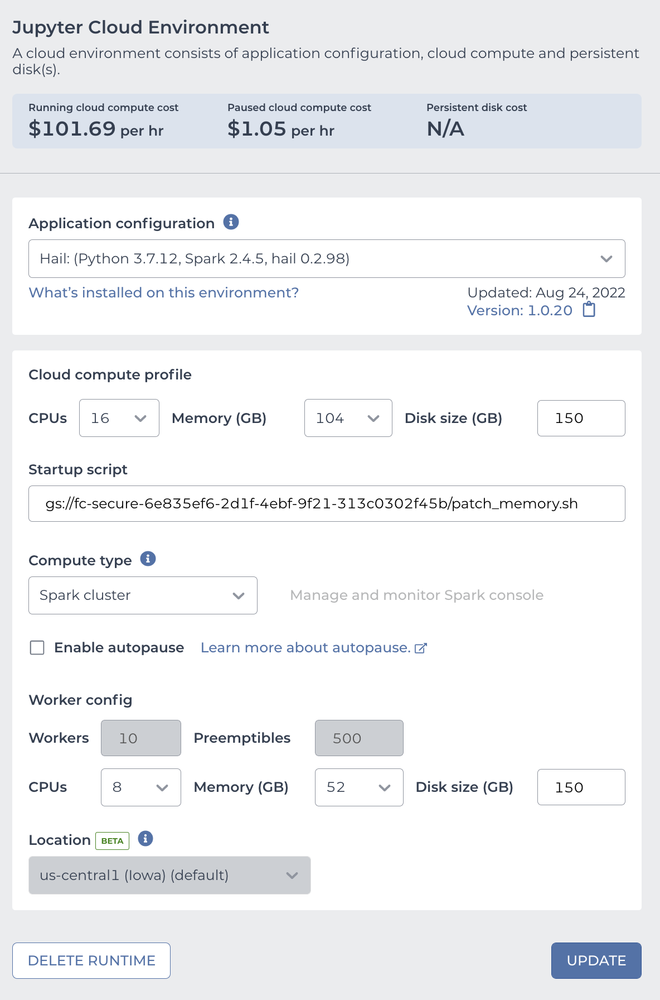

# Removing samples from the AoU VDS

The following example walks through the procedure we followed for removing AI/AN samples from a preliminary version of
the Delta VDS in November 2022. Because we did not have to re-create the filter with these samples removed, we did not
need to re-run the `gvs_import.py` script. Instead we were able to load the previous version of the VDS, create a copy
of the VDS with the samples in question filtered out, and then save this new VDS.

## Configuring the Terra notebook cluster

To work with a Delta-sized VDS (roughly 250K samples) we use our PMI ops accounts to create a cluster in a Terra
customized Jupyter notebook with the following configuration:



The startup script can be found at

```
gs://gvs-internal/bigquery-jointcalling/hail/delta/patch_memory_2022_11_17.sh
```

with contents:

```shell
#!/bin/sh
printf "\nspark.driver.memory=85g\n" >> /etc/spark/conf/spark-defaults.conf
```

**Note:** this script hardcodes a memory value for the driver node. If using a driver node with a different amount of
memory this value should be adjusted to avoid using too little or too much memory. Please ask the Hail team in Zulip if
uncertain what value to use.

## Installing the current Hail wheel

Once the cluster is up and running, open a notebook terminal. Within the terminal copy down the latest Hail wheel. **Note:** you will need the proxy group of your PMI ops account to have at least the "Storage Object Viewer" role on the bucket where the Hail wheel lives.

```
$ gsutil -m cp gs://gvs-internal-scratch/hail-wheels/2022-10-18/0.2.102-964bee061eb0/hail-0.2.102-py3-none-any.whl .
```

Install the Hail wheel and its dependencies. At the time of this writing the installation process produces a lot of
warnings and messages in red text which appear to be benign and can be ignored.

```
$ pip install --force-reinstall hail-0.2.102-py3-none-any.whl
```

## Create a filtered VDS

First start a Python REPL and import Hail:

```python
>>> import hail as hl
```

Read the baseline VDS:

```python
>>> baseline_vds_path = 'gs://fc-secure-fb908548-fe3c-41d6-adaf-7ac20d541375/submissions/c86a6e8f-71a1-4c38-9e6a-f5229520641e/GvsExtractAvroFilesForHail/efb3dbe8-13e9-4542-8b69-02237ec77ca5/call-OutputPath/2022-10-19-6497f023/dead_alleles_removed_vs_667_249047_samples/gvs_export.vds'
>>> baseline_vds = hl.vds.read_vds(baseline_vds_path)
```

## Loading samples to remove into a Hail MatrixTable

To remove samples from a VDS we first create a Hail MatrixTable containing the sample names / research ids we want to
remove.
Back in October 2022 we needed to remove two samples from the VDS, which was a small enough number that we could use a
[literal Python array](https://hail.zulipchat.com/#narrow/stream/123011-Hail-Query-Dev/topic/GVS.20.3C.3D.3E.20Hail.20interop/near/304502823)
with the sample names, something like

```python
>>> samples_to_remove = ['1020832', '1698529']
>>> ht = hl.utils.range_table(len(samples_to_remove))
>>> ht = ht.key_by(s=hl.literal(samples_to_remove)[ht.idx])
```

The literal array approach works well for small numbers of samples, but for the AI/AN scenario we needed to remove
3634 samples. A cleaner approach at this scale was
to [export the sample names from BigQuery to CSV](https://broadworkbench.atlassian.net/browse/VS-721)
and then import the CSV into a Hail MatrixTable:

```python
>>> samples_to_remove_path = 'gs://fc-secure-fb908548-fe3c-41d6-adaf-7ac20d541375/delta_ai_an_removal/ai_an_hail_filtering.csv'
>>> samples_to_remove_table = hl.import_table(samples_to_remove_path, delimiter=',')
>>> samples_to_remove_table = samples_to_remove_table.key_by(s=samples_to_remove_table.research_id)
```

## Create a copy of the VDS with AI/AN samples filtered out

Building on the steps above:

```python
>>> filtered_vds = hl.vds.filter_samples(baseline_vds, samples_to_remove_table, keep=False, remove_dead_alleles=True)
```

## Sanity checks before writing

Writing a Delta-sized VDS takes several hours using the > $100 / hour cluster spec documented above, so it’s a good idea
to do some sanity checking first to make sure there’s nothing obviously wrong. The sample count for the baseline VDS is
given by:

```python
>>> baseline_vds.variant_data.cols().count()
2022-11-15 12:06:30 Hail: WARN: cols(): Resulting column table is sorted by 'col_key'.
    To preserve matrix table column order, first unkey columns with 'key_cols_by()'
249047
```

The sample count for the “samples to remove” table:

```python
>>> samples_to_remove_table.count()
3634
```

And finally the sample count for the filtered VDS:

```python
>>> filtered_vds.variant_data.cols().count()
245413
```

Does this add up?

```python
>>> (filtered_vds.variant_data.cols().count() + samples_to_remove_table.count()) == baseline_vds.variant_data.cols().count()
True
```

Yay!

## Write the filtered VDS

The following lines take 8 to 10 hours for a Delta-sized VDS using the cluster spec above. As a reminder this cluster
costs more than $100 / hour so it would be advisable to schedule the write for a time when the cluster can be paused
soon after the write is expected to complete.

Specify the destination path for the filtered VDS and do the write:

```python
>>> filtered_vds_path='gs://fc-secure-fb908548-fe3c-41d6-adaf-7ac20d541375/delta_ai_an_filtered_2022_11_15.vds'
>>> filtered_vds.write(filtered_vds_path)
```

**Remember to pause or delete the cluster once you’re done!**
